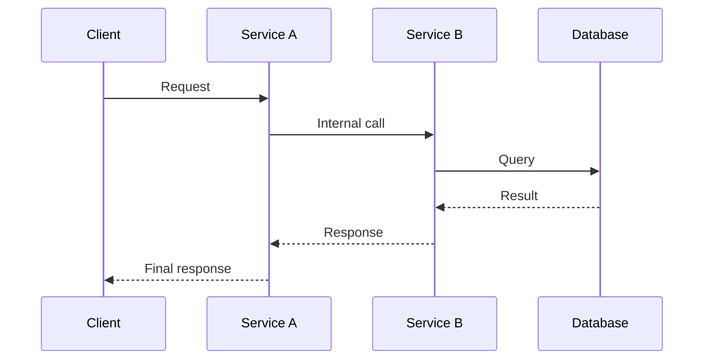
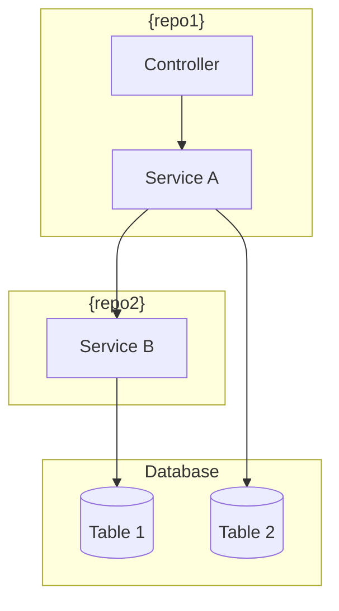

> Parent: [[commands-index]]
<!--
╔══════════════════════════════════════════════════════════════════╗
║ LAYER: FRAMEWORK                                                 ║
║ COMMAND: /task-create                                            ║
║ STATUS: Complete                                                 ║
╠══════════════════════════════════════════════════════════════════╣
║ PURPOSE: Create a new development task                           ║
╚══════════════════════════════════════════════════════════════════╝
-->

# /task-create - Create New Development Task

## Description

Create a new task with work items organized by repository. This command explores the codebase, designs the implementation approach, and creates a structured task folder.

## SCOPE CONSTRAINT
┌─────────────────────────────────────────────────────────────────┐
│ ⛔ DO NOT EDIT APPLICATION CODE                                 │
│                                                                 │
│ ALLOWED:  Read any file. Write ONLY inside .ai/ directory.      │
│ FORBIDDEN: Create, edit, or delete files outside .ai/           │
│ TEMP FILES: Scratch/temporary output goes in .ai/tmp/           │
│                                                                 │
│ This command creates task definitions and documentation.         │
│ It must NEVER modify application source code, tests, or config. │
│ If you find yourself editing code files, STOP — you are off     │
│ track. Only .ai/tasks/, .ai/docs/, and .ai/context.md may be   │
│ written to.                                                     │
└─────────────────────────────────────────────────────────────────┘

## Usage

```
/task-create JIRA-123 "Fix authentication bug"
/task-create LOCAL-001 "Add user profile feature"
/task-create "Add user profile feature"       # Will prompt for ticket ID
```

## Workflow

```
1. VALIDATE INPUT
   • Check JIRA/ticket format matches conventions
   • Ensure title is provided

2. EXPLORE CONTEXT
   • Launch Explore agents on relevant repos
   • Identify affected files and patterns
   • Understand current implementation

3. DESIGN APPROACH
   • Launch Plan agent for implementation design
   • Break down into work items per repo
   • Identify dependencies and order

4. GENERATE DIAGRAMS (if multi-repo or complex)
   • Create sequence diagram showing data/request flow
   • Create component diagram showing service interactions
   • Embed as Mermaid code blocks in task note

5. CREATE TASK STRUCTURE
   • Create .ai/tasks/{ticket-id}/
   • Generate {ticket-id}.md task note with frontmatter and diagrams
   • Create work item notes with frontmatter status: todo
   • Add [[{ticket-id}]] to task-index.md

6. OUTPUT SUMMARY
   • Task location
   • Work item count
   • Suggested starting point
```

## Implementation

### Step 0: Orientation

1. Read `.ai/_project/manifest.md` using `get_frontmatter("_project/manifest.md")` to understand:
   - Available repositories
   - JIRA prefix and conventions
   - Commit message patterns
   - Available MCPs

2. **Extension Support**: This command supports compiled extensions
   via `/command-extend task-create --variant NAME`. If a compiled extension
   exists, the stub already points to it — no runtime discovery needed.

3. Announce:
```
╔══════════════════════════════════════════════════════════════════╗
║ TASK CREATION                                                    ║
╚══════════════════════════════════════════════════════════════════╝

Project: {project.name}
Repos: {list of repo names}
JIRA Prefix: {conventions.jira.prefix}
```

### Step 1: Parse Arguments

Extract from user input:
- **Ticket ID**: The JIRA/LOCAL identifier (e.g., `PROJ-123`)
- **Title**: The task description

**Validation Rules:**
1. If no ticket ID provided, ask:
   ```
   What's the ticket ID for this task?
   Expected format: {conventions.jira.prefix}-XXX (or LOCAL-XXX for local tasks)
   ```

2. If ticket ID doesn't match prefix in manifest, warn:
   ```
   Warning: Ticket prefix doesn't match configured prefix ({conventions.jira.prefix}).
   Continue anyway? (y/n)
   ```

3. If no title provided, ask:
   ```
   What's a brief title for this task? (e.g., "Fix authentication timeout")
   ```

### Step 2: Gather Context

Ask the user:
```
Tell me about this task:
1. What's the problem or feature?
2. Which repos will be affected?
3. Any specific files or areas you know about?
4. Any constraints or requirements I should know?
```

Based on the answer, determine:
- Which repos to explore
- What to look for during exploration

### Step 3: Explore Codebase

┌─────────────────────────────────────────────────────────────────┐
│ ⚠️  MANDATORY: INVOKE EXPLORER AGENT                            │
│                                                                 │
│ You MUST invoke the explorer agent for each relevant repo.      │
│ Do NOT skip this step or explore the codebase yourself.         │
│ The explorer agent ensures thorough, structured exploration.    │
│                                                                 │
│ If you find yourself using Glob/Grep/Read directly instead of   │
│ invoking the explorer agent, STOP — you are off track.          │
└─────────────────────────────────────────────────────────────────┘

For each relevant repo, invoke the explorer agent:
```
Invoke the explorer agent to explore {repo.name} repository focusing on:
- {user's described problem/feature area}
- Related files and patterns
- Existing implementations to learn from
- Test patterns to follow
- Configuration requirements
```

Compile findings from the explorer agent:
- Key files involved
- Patterns to follow
- Potential risks
- Dependencies

### Step 4: Design Implementation

┌─────────────────────────────────────────────────────────────────┐
│ ⚠️  MANDATORY: INVOKE PLANNER AGENT                             │
│                                                                 │
│ You MUST invoke the planner agent before proceeding.            │
│ Do NOT skip this step or design the plan yourself.              │
│ The planner agent ensures consistent work item structure.       │
│                                                                 │
│ If you find yourself creating work items without invoking the   │
│ planner agent, STOP — you are off track.                        │
└─────────────────────────────────────────────────────────────────┘

Invoke the planner agent to design the implementation:
```
Invoke the planner agent to design an implementation plan for: {title}

Context:
- Problem: {user's problem description}
- Exploration findings: {compiled exploration results}

Create:
1. High-level approach
2. Work items broken down by repo
3. Implementation order (dependencies)
4. Risk assessment
5. Testing approach
```

From the planner agent output, extract:
- List of work items with: id, name, repo, description
- Suggested order
- Acceptance criteria

### Step 5: Generate Diagrams (If Applicable)

**Trigger conditions:**
- Task affects multiple repositories, OR
- Task involves complex data/request flows, OR
- User explicitly requests diagrams

**Generate Mermaid diagrams** to visualize the implementation:

**5a. Sequence Diagram** (for request/data flows):


**5b. Component Diagram** (for service interactions):


**Note:** These diagrams use native Mermaid syntax and will be embedded directly in the task note. Many editors and viewers render Mermaid automatically.

### Step 5b: Pre-Confirmation Checklist

┌─────────────────────────────────────────────────────────────────┐
│ ⛔ CHECKPOINT: VERIFY MANDATORY STEPS COMPLETED                 │
│                                                                 │
│ Before proceeding to Step 6, verify ALL are true:               │
│                                                                 │
│   □ Explorer agent was invoked for each relevant repo           │
│   □ Planner agent was invoked to design work items              │
│   □ Work items have repo assignments and dependencies           │
│                                                                 │
│ If ANY checkbox is unchecked, GO BACK and complete that step.   │
│ Do NOT proceed to Step 6 with missing agent invocations.        │
└─────────────────────────────────────────────────────────────────┘

### Step 6: Confirm with User

Present the plan:
```
╔══════════════════════════════════════════════════════════════════╗
║ PROPOSED TASK STRUCTURE                                          ║
╚══════════════════════════════════════════════════════════════════╝

Task: {ticket-id} - {title}

Work Items:
  01. {name} ({repo})
      {brief description}
  02. {name} ({repo})
      {brief description}
  ...

Acceptance Criteria:
  - {criterion 1}
  - {criterion 2}

Does this look right? Any changes needed?
```

Iterate until user approves.

### Step 6b: Select Task Color (Optional)

Ask the user to optionally select a color for the task to help with visual identification:

```
TASK COLOR (optional)

Select a color for this task to help identify it and its sessions:

  1. Red      (charts.red)
  2. Orange   (charts.orange)
  3. Yellow   (charts.yellow)
  4. Green    (charts.green)
  5. Blue     (charts.blue)
  6. Purple   (charts.purple)
  7. None     (use default status-based colors)

Choice (1-7, default: 7):
```

Store the selected color for use in task note frontmatter generation. If user presses Enter without selection, use "None" (no color).

### Step 7: Create Task Structure

**7a. Create task note** `.ai/tasks/{ticket-id}/{ticket-id}.md` using `write_note`:

```markdown
---
type: task
status: todo
task: "{ticket-id}"
title: "{title}"
{if color selected}
color: "{selected-color}"
{/if}
created: "{YYYY-MM-DD}"
updated: "{YYYY-MM-DD}"
summary:
  total: {count}
  todo: {count}
  in_progress: 0
  done: 0
tags:
  - task
  - todo
---

> Parent: [[task-index]]

<!--
╔══════════════════════════════════════════════════════════════════╗
║ LAYER: TASK                                                      ║
║ LOCATION: .ai/tasks/{ticket-id}/                                ║
╠══════════════════════════════════════════════════════════════════╣
║ BEFORE WORKING ON THIS TASK:                                     ║
║ 1. Read .ai/_project/manifest.md (know repos & MCPs)            ║
║ 2. Read this entire note first                                   ║
║ 3. Check work item frontmatter for status (todo/in_progress/done)║
║ 4. Work on ONE item at a time                                    ║
╚══════════════════════════════════════════════════════════════════╝
-->

# {ticket-id}: {title}

## Problem Statement

{user's problem description}

## Acceptance Criteria

{list from planning phase}

## Work Items

| ID | Name | Repo | Status |
|----|------|------|--------|
{for each work item}
| [[{ticket-id}-{id}]] | {name} | {repo} | todo |
{/for}

## Branches

{if ALL affected repos are protected}
**Note:** All affected repos are protected. No task branches will be created.
Work will be done on existing branches in the protected repos.

**Protected Repos:**
{for each affected repo}
- ⛔ {repo} - stays on `{locked_branch}`
{/for}
{else}
| Repo | Path | Branch |
|------|------|--------|
{for each affected repo WHERE protected != true}
| {repo} | `{absolute_path}` | `{ticket-id}-{short-description}` |
{/for}

{if any protected repos in affected list}
**Protected Repos (no branches created):**
{for each affected repo WHERE protected == true}
- ⛔ {repo} - stays on `{locked_branch}`
{/for}
{/if}
{/if}

## Technical Context

{exploration findings}

## Architecture Diagrams

{if diagrams were generated in Step 5, include them here}

### Request/Data Flow
```mermaid
{sequence diagram from Step 5}
```

### Service Interactions
```mermaid
{component diagram from Step 5}
```

{if no diagrams: remove this section}

## Implementation Approach

{plan summary}

## Risks & Considerations

{risks from planning}

## Testing Strategy

{testing approach from planning}

## Feedback

Review comments can be added to [[{ticket-id}-diff-review]].
Use `/address-feedback` to discuss feedback with the agent.

## References

- Related docs: ...
```

**7b. Create work item notes** in `.ai/tasks/{ticket-id}/` using `write_note`.

For each work item, create `{ticket-id}-{id}.md`:

```markdown
---
type: work-item
status: todo
id: "{id}"
task: "{ticket-id}"
name: "{name}"
repo: "{repo}"
repo_path: "{absolute_path}"
repo_protected: {true|false}
branch: "{branch_name}"
tags:
  - work-item
  - todo
  - {repo}
---

> Parent: [[{ticket-id}]]

<!--
╔══════════════════════════════════════════════════════════════════╗
║ WORK ITEM: {ticket-id}-{id}                                     ║
║ TASK: {ticket-id}                                               ║
╠══════════════════════════════════════════════════════════════════╣
║ WORKFLOW:                                                        ║
║ 1. Update frontmatter status to in_progress when starting       ║
║ 2. Complete ALL steps below                                      ║
║ 3. Update frontmatter status to done when complete              ║
║ 4. Update parent task note summary counts                       ║
║ 5. Update task note with any learnings                          ║
╚══════════════════════════════════════════════════════════════════╝
-->

# {Work Item Title}

## Objective

{what this work item accomplishes}

## Pre-Implementation

Before starting, consider running an **exploration agent** to gather context about the affected code areas.

## Git Safety Reminder

Before any git operation:
1. `cd {repo_path}`
2. Verify: `git rev-parse --show-toplevel`
3. Verify: `git branch --show-current`

## Implementation Steps

### Step 1: {step name}

**File**: `{file path}`

**Instructions**:
{detailed instructions from planning}

{additional steps as needed}

## Post-Implementation

After completing, run a **code review agent** to check for issues.

## Acceptance Criteria

{specific criteria for this work item}

## Testing

{how to verify this work item}

## Notes

{any additional context or warnings}
```

**Path Validation:** Ensure `repo_path` is an absolute path before writing:
- If manifest `path` is relative (starts with `./`): resolve against `project.root`
- Verify the resolved path exists and contains a `.git` directory
- Store the fully resolved absolute path, never a relative path

**Note:** The `color` field is optional. Valid values are: `charts.red`, `charts.orange`, `charts.yellow`, `charts.green`, `charts.blue`, `charts.purple`. Only include the color field if the user selected one in Step 6b.

**7c. Create feedback note** `.ai/tasks/{ticket-id}/{ticket-id}-diff-review.md` using `write_note`:

If a feedback template exists at `.ai/_framework/templates/feedback-template.md`, read it and use its content. Otherwise create a minimal feedback note:

```markdown
---
type: feedback
task: "{ticket-id}"
tags:
  - feedback
  - {ticket-id}
---

> Parent: [[{ticket-id}]]

# Diff Feedback

Add your feedback below using the format:

### path/to/file.ts:42
Your comment here
```

**7d. Update task-index.md** — add `[[{ticket-id}]]` to `.ai/tasks/task-index.md` body using `patch_note`.

### Step 8: Update Context

Update `.ai/context.md` to reflect the new task in "Current State" section.

### Step 9: Output Summary

```
╔══════════════════════════════════════════════════════════════════╗
║ TASK CREATED                                                     ║
╚══════════════════════════════════════════════════════════════════╝

Location: .ai/tasks/{ticket-id}/

Work Items:
  📋 {count} items created (status: todo)

  {list each work item with id and name}

Branches to Create:
{for each non-protected repo}
  {repo}: cd {absolute_path} && git checkout -b {branch-name}
{/for}

{if protected repos exist}
Protected (no branches):
{for each protected repo}
  ⛔ {repo}: stays on {locked_branch}
{/for}
{/if}

Next Steps:
  1. Review the task note: .ai/tasks/{ticket-id}/{ticket-id}.md
  2. Run /task-start {ticket-id} to begin working
  3. Or run /task-status to see all tasks

Quick Commands:
  • /task-start {ticket-id}     Begin this task
  • /task-status                View dashboard
```

### Step 10: Auto-Sync (if enabled)

Read `.ai/_project/manifest.md` frontmatter using `get_frontmatter("_project/manifest.md")` and check the `auto_sync.enabled` field.

**If auto_sync is enabled:**

Use the [[ai-sync]] agent to commit and push changes:
```
Use the ai-sync agent to sync the .ai folder changes
```

This ensures task creation is tracked in version control automatically.

**If auto_sync is disabled:** Skip this step.

Then stop. Do not proceed further.
