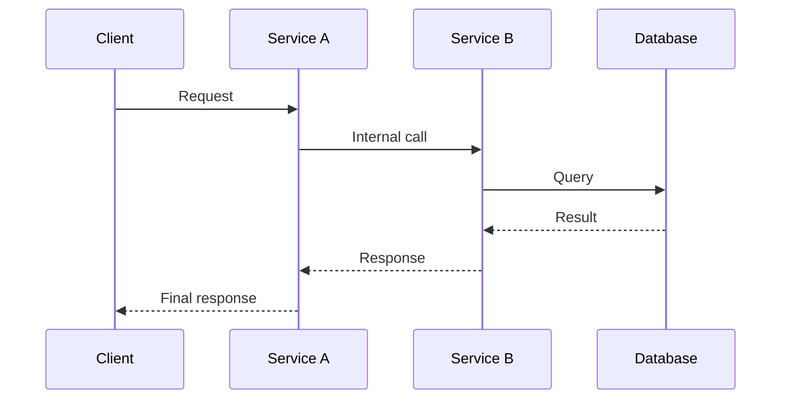
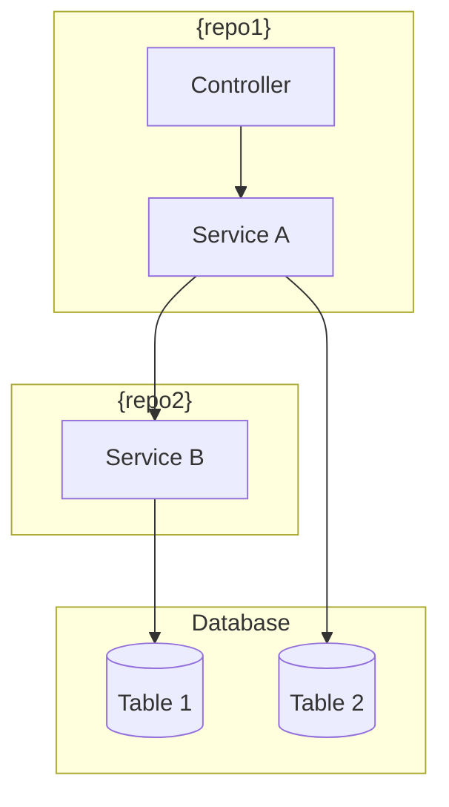

<!--
╔══════════════════════════════════════════════════════════════════╗
║ LAYER: FRAMEWORK                                                 ║
║ COMMAND: /task-create                                            ║
║ STATUS: Complete                                                 ║
╠══════════════════════════════════════════════════════════════════╣
║ PURPOSE: Create a new development task                           ║
╚══════════════════════════════════════════════════════════════════╝
-->

# /task-create - Create New Development Task

## Description

Create a new task with work items organized by repository. This command explores the codebase, designs the implementation approach, and creates a structured task folder.

## SCOPE CONSTRAINT
┌─────────────────────────────────────────────────────────────────┐
│ ⛔ DO NOT EDIT APPLICATION CODE                                 │
│                                                                 │
│ ALLOWED:  Read any file. Write ONLY inside .ai/ directory.      │
│ FORBIDDEN: Create, edit, or delete files outside .ai/           │
│ TEMP FILES: Scratch/temporary output goes in .ai/tmp/           │
│                                                                 │
│ This command creates task definitions and documentation.         │
│ It must NEVER modify application source code, tests, or config. │
│ If you find yourself editing code files, STOP — you are off     │
│ track. Only .ai/tasks/, .ai/docs/, and .ai/context.md may be   │
│ written to.                                                     │
└─────────────────────────────────────────────────────────────────┘

## Usage

```
/task-create JIRA-123 "Fix authentication bug"
/task-create LOCAL-001 "Add user profile feature"
/task-create "Add user profile feature"       # Will prompt for ticket ID
```

## Workflow

```
1. VALIDATE INPUT
   • Check JIRA/ticket format matches conventions
   • Ensure title is provided

2. EXPLORE CONTEXT
   • Launch Explore agents on relevant repos
   • Identify affected files and patterns
   • Understand current implementation

3. DESIGN APPROACH
   • Launch Plan agent for implementation design
   • Break down into work items per repo
   • Identify dependencies and order

4. GENERATE DIAGRAMS (if multi-repo or complex)
   • Create sequence diagram showing data/request flow
   • Create component diagram showing service interactions
   • Embed as Mermaid code blocks in README

5. CREATE TASK STRUCTURE
   • Create .ai/tasks/todo/{task-name}/
   • Generate README.md from template (with diagrams)
   • Generate status.yaml with work items index
   • Create todo/, in_progress/, done/ folders
   • Create work item files in todo/

6. OUTPUT SUMMARY
   • Task location
   • Work item count per repo
   • Suggested starting point
```

## Implementation

### Step 0: Orientation

1. Read `.ai/_project/manifest.yaml` to understand:
   - Available repositories
   - JIRA prefix and conventions
   - Commit message patterns
   - Available MCPs

2. **Extension Support**: This command supports compiled extensions
   via `/command-extend task-create --variant NAME`. If a compiled extension
   exists, the stub already points to it — no runtime discovery needed.

3. Announce:
```
╔══════════════════════════════════════════════════════════════════╗
║ TASK CREATION                                                    ║
╚══════════════════════════════════════════════════════════════════╝

Project: {project.name}
Repos: {list of repo names}
JIRA Prefix: {conventions.jira.prefix}
```

### Step 1: Parse Arguments

Extract from user input:
- **Ticket ID**: The JIRA/LOCAL identifier (e.g., `PROJ-123`)
- **Title**: The task description

**Validation Rules:**
1. If no ticket ID provided, ask:
   ```
   What's the ticket ID for this task?
   Expected format: {conventions.jira.prefix}-XXX (or LOCAL-XXX for local tasks)
   ```

2. If ticket ID doesn't match prefix in manifest, warn:
   ```
   Warning: Ticket prefix doesn't match configured prefix ({conventions.jira.prefix}).
   Continue anyway? (y/n)
   ```

3. If no title provided, ask:
   ```
   What's a brief title for this task? (e.g., "Fix authentication timeout")
   ```

### Step 2: Gather Context

Ask the user:
```
Tell me about this task:
1. What's the problem or feature?
2. Which repos will be affected?
3. Any specific files or areas you know about?
4. Any constraints or requirements I should know?
```

Based on the answer, determine:
- Which repos to explore
- What to look for during exploration

### Step 3: Explore Codebase

For each relevant repo, launch an Explore agent:
```
Explore {repo.name} repository focusing on:
- {user's described problem/feature area}
- Related files and patterns
- Existing implementations to learn from
- Test patterns to follow
- Configuration requirements
```

Compile findings:
- Key files involved
- Patterns to follow
- Potential risks
- Dependencies

### Step 4: Design Implementation

Launch a Plan agent to design the implementation:
```
Design an implementation plan for: {title}

Context:
- Problem: {user's problem description}
- Exploration findings: {compiled exploration results}

Create:
1. High-level approach
2. Work items broken down by repo
3. Implementation order (dependencies)
4. Risk assessment
5. Testing approach
```

From the plan, extract:
- List of work items with: id, name, repo, description
- Suggested order
- Acceptance criteria

### Step 5: Generate Diagrams (If Applicable)

**Trigger conditions:**
- Task affects multiple repositories, OR
- Task involves complex data/request flows, OR
- User explicitly requests diagrams

**Generate Mermaid diagrams** to visualize the implementation:

**5a. Sequence Diagram** (for request/data flows):


**5b. Component Diagram** (for service interactions):


**Note:** These diagrams use native Mermaid syntax and will be embedded directly in the task README.md. Many editors and viewers render Mermaid automatically.

### Step 6: Confirm with User

Present the plan:
```
╔══════════════════════════════════════════════════════════════════╗
║ PROPOSED TASK STRUCTURE                                          ║
╚══════════════════════════════════════════════════════════════════╝

Task: {ticket-id} - {title}

Work Items:
  01. {name} ({repo})
      {brief description}
  02. {name} ({repo})
      {brief description}
  ...

Acceptance Criteria:
  - {criterion 1}
  - {criterion 2}

Does this look right? Any changes needed?
```

Iterate until user approves.

### Step 6b: Select Task Color (Optional)

Ask the user to optionally select a color for the task to help with visual identification:

```
TASK COLOR (optional)

Select a color for this task to help identify it and its sessions:

  1. Red      (charts.red)
  2. Orange   (charts.orange)
  3. Yellow   (charts.yellow)
  4. Green    (charts.green)
  5. Blue     (charts.blue)
  6. Purple   (charts.purple)
  7. None     (use default status-based colors)

Choice (1-7, default: 7):
```

Store the selected color for use in status.yaml generation. If user presses Enter without selection, use "None" (no color).

### Step 7: Create Task Structure

**7a. Create task directory:**
`.ai/tasks/todo/{ticket-id}/`

**7b. Create sub-directories:**
- `todo/`
- `in_progress/`
- `done/`
- `feedback/`

**7c. Create README.md** (from `_framework/templates/task-readme.md`, include diagrams from Step 5):
```markdown
<!--
╔══════════════════════════════════════════════════════════════════╗
║ LAYER: TASK                                                      ║
║ LOCATION: .ai/tasks/todo/{ticket-id}/                           ║
╠══════════════════════════════════════════════════════════════════╣
║ BEFORE WORKING ON THIS TASK:                                     ║
║ 1. Read .ai/_project/manifest.yaml (know repos & MCPs)          ║
║ 2. Read this entire README first                                 ║
║ 3. Check which work items are in todo/ vs done/                 ║
║ 4. Work on ONE item at a time from todo/                        ║
╚══════════════════════════════════════════════════════════════════╝
-->

# {ticket-id}: {title}

## Problem Statement

{user's problem description}

## Acceptance Criteria

{list from planning phase}

## Work Items

See `status.yaml` for full index.

| ID | Name | Repo | Status |
|----|------|------|--------|
{for each work item}
| {id} | {name} | {repo} | todo |
{/for}

## Branches

{if ALL affected repos are protected}
**Note:** All affected repos are protected. No task branches will be created.
Work will be done on existing branches in the protected repos.

**Protected Repos:**
{for each affected repo}
- ⛔ {repo} - stays on `{locked_branch}`
{/for}
{else}
| Repo | Path | Branch |
|------|------|--------|
{for each affected repo WHERE protected != true}
| {repo} | `{absolute_path}` | `{ticket-id}-{short-description}` |
{/for}

{if any protected repos in affected list}
**Protected Repos (no branches created):**
{for each affected repo WHERE protected == true}
- ⛔ {repo} - stays on `{locked_branch}`
{/for}
{/if}
{/if}

## Technical Context

{exploration findings}

## Architecture Diagrams

{if diagrams were generated in Step 5, include them here}

### Request/Data Flow
```mermaid
{sequence diagram from Step 5}
```

### Service Interactions
```mermaid
{component diagram from Step 5}
```

{if no diagrams: remove this section}

## Implementation Approach

{plan summary}

## Risks & Considerations

{risks from planning}

## Testing Strategy

{testing approach from planning}

## Feedback

Review comments can be added to `feedback/diff-review.md`.
Use `/address-feedback` to discuss feedback with the agent.

## References

- Related docs: ...
```

**7d. Create status.yaml:**
```yaml
# Task Status Index
task: "{ticket-id}"
title: "{title}"
{if color selected}
color: "{selected-color}"  # e.g., charts.purple
{/if}
created: "{YYYY-MM-DD}"
updated: "{YYYY-MM-DD}"

summary:
  total: {count}
  todo: {count}
  in_progress: 0
  done: 0

work_items:
{for each work item}
  - id: "{id}"
    name: "{name}"
    repo: "{repo}"
    repo_path: "{absolute_path}"
    repo_protected: {true|false}
    status: todo
    file: "todo/{id}-{slug}.md"
{/for}
```

**Path Validation:** Ensure `repo_path` is an absolute path before writing:
- If manifest `path` is relative (starts with `./`): resolve against `project.root`
- Verify the resolved path exists and contains a `.git` directory
- Store the fully resolved absolute path, never a relative path

**Note:** The `color` field is optional. Valid values are: `charts.red`, `charts.orange`, `charts.yellow`, `charts.green`, `charts.blue`, `charts.purple`. Only include the color field if the user selected one in Step 6b.

**7e. Create work item files** in `todo/`:
For each work item, create `{id}-{slug}.md`:
```markdown
<!--
╔══════════════════════════════════════════════════════════════════╗
║ WORK ITEM: {id}-{slug}.md                                       ║
║ TASK: {ticket-id}                                               ║
╠══════════════════════════════════════════════════════════════════╣
║ WORKFLOW:                                                        ║
║ 1. Move this file to in_progress/ when starting                 ║
║ 2. Update status.yaml with new status                           ║
║ 3. Complete ALL steps below                                      ║
║ 4. Move to done/ when complete, update status.yaml              ║
║ 5. Update task README with any learnings                        ║
╚══════════════════════════════════════════════════════════════════╝
-->

---
# Repository Context (LOCAL-026)
repo: {repo}
repo_path: {absolute_path}
branch: {branch_name}
protected: {true|false}

# Git Safety Reminder
# Before any git operation:
#   1. cd {repo_path}
#   2. Verify: git rev-parse --show-toplevel
#   3. Verify: git branch --show-current
---

# {Work Item Title}

## Objective

{what this work item accomplishes}

## Pre-Implementation

Before starting, consider running an **exploration agent** to gather context about the affected code areas.

## Implementation Steps

### Step 1: {step name}

**File**: `{file path}`

**Instructions**:
{detailed instructions from planning}

{additional steps as needed}

## Post-Implementation

After completing, run a **code review agent** to check for issues.

## Acceptance Criteria

{specific criteria for this work item}

## Testing

{how to verify this work item}

## Notes

{any additional context or warnings}
```

**7f. Create feedback file:**
Copy the feedback template to the task's feedback folder:
```
.ai/_framework/templates/feedback-template.md → .ai/tasks/todo/{ticket-id}/feedback/diff-review.md
```

If the template doesn't exist, create a minimal feedback file:
```markdown
# Diff Feedback

Add your feedback below using the format:

### path/to/file.ts:42
Your comment here
```

### Step 8: Update Context

Update `.ai/context.md` to reflect the new task in "Current State" section.

### Step 9: Output Summary

```
╔══════════════════════════════════════════════════════════════════╗
║ TASK CREATED                                                     ║
╚══════════════════════════════════════════════════════════════════╝

Location: .ai/tasks/todo/{ticket-id}/

Work Items:
  📋 {count} items in todo/

  {list each work item with id and name}

Branches to Create:
{for each non-protected repo}
  {repo}: cd {absolute_path} && git checkout -b {branch-name}
{/for}

{if protected repos exist}
Protected (no branches):
{for each protected repo}
  ⛔ {repo}: stays on {locked_branch}
{/for}
{/if}

Next Steps:
  1. Review the task README: .ai/tasks/todo/{ticket-id}/README.md
  2. Run /task-start {ticket-id} to begin working
  3. Or run /task-status to see all tasks
  • If session is unassigned, use "Link to Task" in Cockpit sidebar

Quick Commands:
  • /task-start {ticket-id}     Begin this task
  • /task-status                View dashboard
```

### Step 9.5: Link Current Session (if applicable)

If running in a Cockpit session that is unassigned, offer to link it to the new task:

1. Check if there's an active unassigned session:
   - Look for terminal with `COCKPIT_TERMINAL_ID` env var but no `COCKPIT_TASK`
   - Or check `.ai/cockpit/sessions.json` for active sessions with `taskId: "_unassigned"`

2. If an unassigned session is found, ask:
   ```
   LINK SESSION

   You're working in an unassigned session. Link it to {ticket-id}?

   This will associate your current session history with the new task.

   Link session? (y/n)
   ```

3. If yes, update the session:
   - Update session's taskId from "_unassigned" to new task ID
   - Refresh the Cockpit tree view

4. If no, continue without linking.

**Note**: This step requires the AI Cockpit VSCode extension. When running outside
VSCode or without the extension, this step is skipped silently.

### Step 10: Auto-Sync (if enabled)

Check `.ai/_project/manifest.yaml` for `auto_sync.enabled`.

**If auto_sync is enabled:**

Use the ai-sync agent to commit and push changes:
```
Use the ai-sync agent to sync the .ai folder changes
```

This ensures task creation is tracked in version control automatically.

**If auto_sync is disabled:** Skip this step.

Then stop. Do not proceed further.
