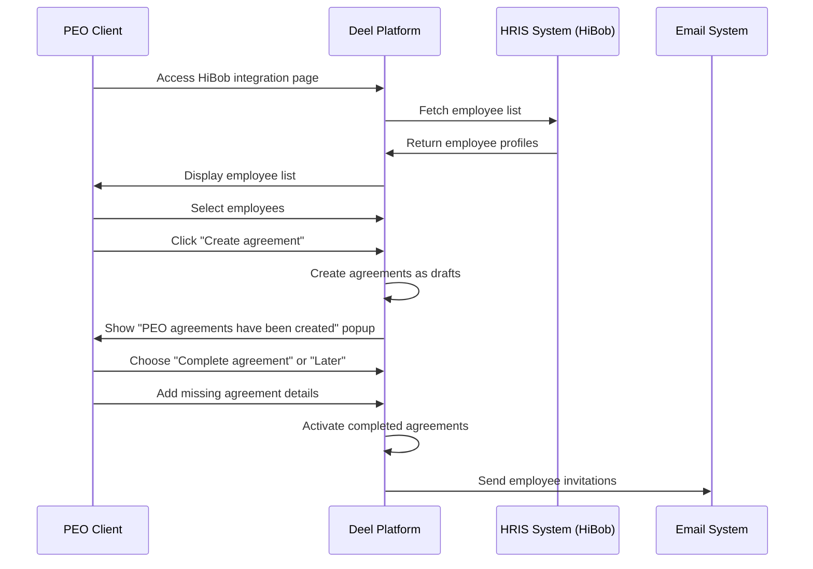
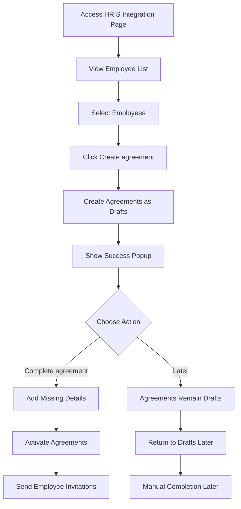
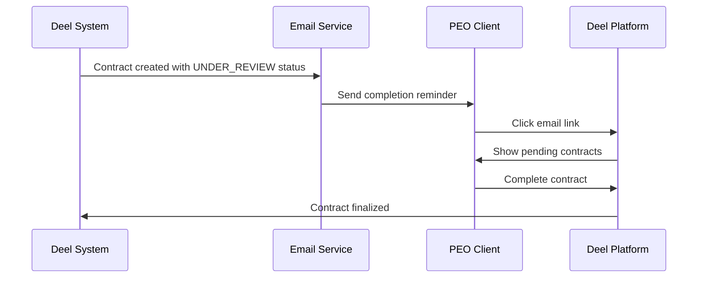
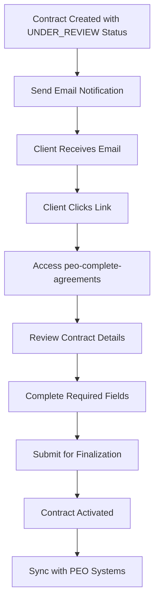
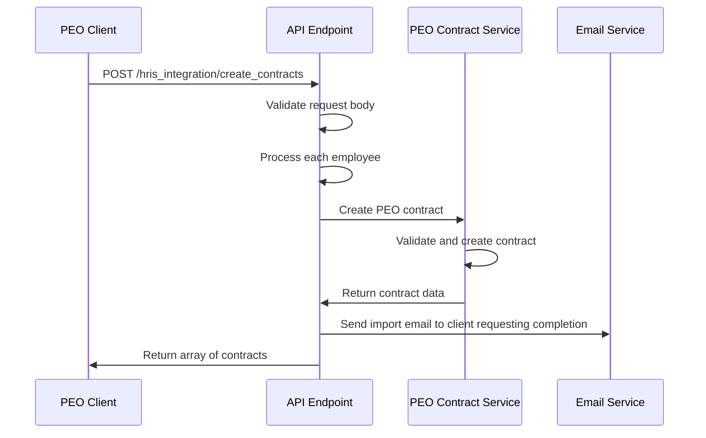
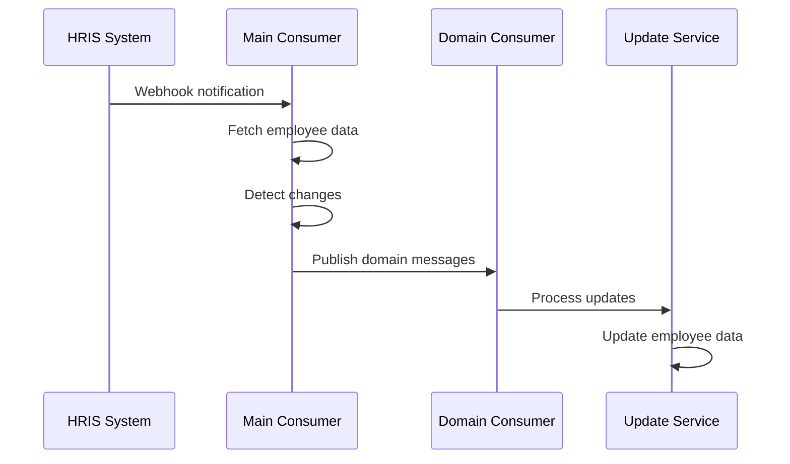
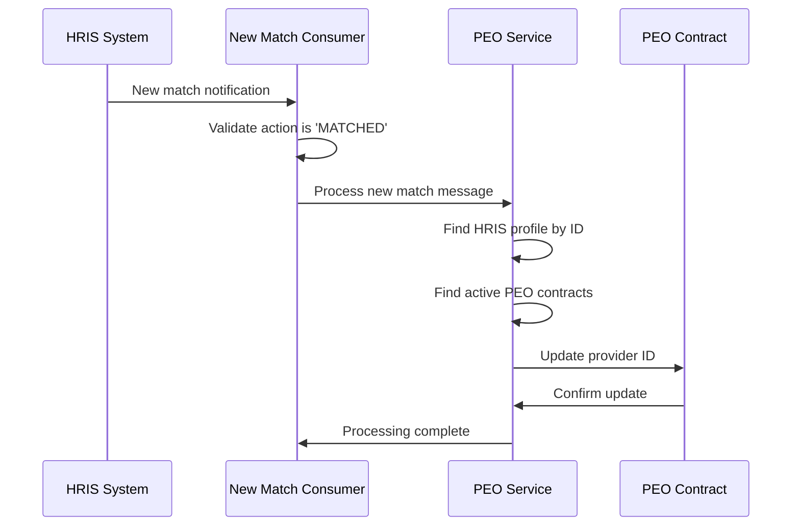
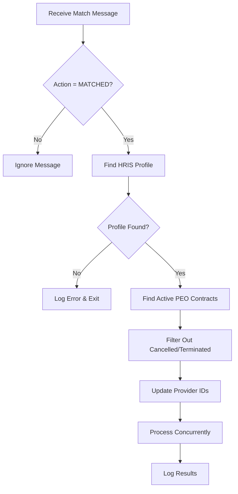

# 📦 Module: PEO HRIS Integrations

**[Datadog Monitoring](https://app.datadoghq.eu/monitors/manage?saved-view-id=182647)**

> **Module Description:**
> PEO HRIS integrations are a feature offered by Deel that allows Professional Employer Organization (PEO) clients to connect their Human Resource Information Systems (HRIS) with Deel's platform. This integration enables manual creation of PEO agreements using employee data from connected HRIS systems, streamlining the employee onboarding process.

---

## 📚 Glossary

| Term                      | Definition                                                                                       |
|---------------------------|--------------------------------------------------------------------------------------------------|
| **PEO**                   | Professional Employer Organization - a service that provides comprehensive HR solutions for businesses |
| **HRIS**                  | Human Resource Information System - software for managing employee data and HR processes |
| **Integration Provider**  | Third-party HRIS system (HiBob, Workday GCP) that connects to Deel's platform |
| **Provider ID**           | Unique identifier for an employee within the HRIS system |
| **Domain Update**         | Specific type of employee data update (demographic, job data, compensation, etc.) |
| **Change Detection**      | Process of comparing current HRIS data with cached data to identify updates |
| **Mass Onboarding**       | Process of creating multiple PEO agreements simultaneously from HRIS data |

---

## 🏗️ Technical Overview

> Outline the core architecture, design decisions, and data flow for PEO HRIS Integrations.

### Supported HRIS Providers

The PEO HRIS integration currently supports the following HRIS providers:

- **HiBob** - Modern HRIS platform for growing companies
- **Workday GCP** - Enterprise-level HR and financial management platform

### Key Functionalities

#### 1. Mass PEO Employee Agreement Creation

The integration provides a manual workflow for creating PEO agreements using HRIS employee profiles:

##### Phase 1: Employee Selection and Agreement Creation

Clients can access their connected HRIS (e.g., HiBob) through the Deel platform to:

- **View Employee List**: See all employees from the connected HRIS system
- **Select Employees**: Manually select which employees to create agreements for
- **Create Agreements**: Click "Create agreement" to generate PEO agreements
- **Draft Creation**: Agreements are created as drafts with basic employee information

##### Phase 2: Agreement Completion

After agreement creation, clients must complete the agreements:

- **Completion Notification**: Popup confirms "PEO agreements have been created" with draft status
- **Action Options**: Clients can choose "Complete agreement" or "Later"
- **Detail Completion**: When completing agreements, clients add missing details
- **Employee Invitation**: Once completed, employees are invited to the Deel platform

#### Agreement Creation Flow



#### Agreement Creation Process Diagram



#### 2. Employee Data Updates

The system continuously synchronizes employee information from the HRIS to Deel's platform, including:

### Update Domains

The PEO HRIS integration system processes employee data updates across several key domains, each handling specific aspects of employee information:

#### 1. **Demographic Information Updates**

**Purpose**: Synchronizes basic employee personal information and demographic data.

**Data Fields Processed**:
- **Personal Information**: First name, last name, middle name
- **Contact Details**: Personal email, personal phone number
- **Demographics**: Date of birth, nationality, country, gender
- **Identification**: Social Security Number (SSN) with proper formatting

**Update Process**:
- Updates employee profile information in Deel's database
- Modifies contract name to reflect employee's legal name
- Updates HRIS profile records with current information
- Synchronizes data with external PEO systems when significant changes occur

**Key Features**:
- Handles partial updates (only processes fields with actual values)
- Maintains data integrity through transaction management
- Validates data completeness before processing
- Preserves existing contract suffixes when updating names

#### 2. **Job Data Updates**

**Purpose**: Manages comprehensive job-related information including position, location, and organizational structure.

**Data Fields Processed**:
- **Job Information**: Job title, job description, work location
- **Employment Details**: Employment status, employment type, hire date, start date
- **Compensation**: Pay type, pay rate, pay currency, weekly hours
- **Organization**: Department, reporting structure, manager information
- **Address**: Employee work address with validation and geo-coding

**Update Process**:
- Updates employee profile with current job information
- Modifies contract details to reflect new position
- Updates work statement records
- Synchronizes organizational structure changes
- Validates and geo-codes employee addresses
- Updates PEO contract with location and job code information

**Key Features**:
- Matches job titles against approved job codes
- Validates work locations against PEO location database
- Handles organizational structure changes
- Processes address validation and geo-coding
- Updates employment terms when necessary

#### 3. **Compensation Updates**

**Purpose**: Manages employee compensation and employment terms.

**Data Fields Processed**:
- **Employment Type**: Full-time/part-time status
- **Pay Method**: Salary or hourly compensation
- **Pay Rate**: Compensation amount and currency
- **Work Hours**: Weekly working hours
- **Effective Dates**: When compensation changes take effect

**Update Process**:
- Retrieves the most recent employment and compensation records
- Validates employment type and effective dates
- Transforms HRIS data format to Deel's internal format
- Updates compensation information on effective dates
- Prevents duplicate employment terms

**Key Features**:
- Processes multiple employment and compensation records
- Validates effective dates to ensure timely updates
- Transforms pay methods (HOUR → HOURLY, others → SALARY)
- Handles employment type mapping (FULL_TIME/PART_TIME)
- Prevents creation of duplicate employment terms

#### 4. **Bank Information Updates**

**Purpose**: Manages employee bank account information for payroll processing.

**Data Fields Processed**:
- **Account Information**: Bank account number, routing number
- **Bank Details**: Bank name, account type (checking/savings)
- **Account Type**: Transforms HRIS account types to Deel's format

**Update Process**:
- Processes multiple bank accounts per employee
- Validates minimum required data (account number, routing number, bank name, account type)
- Prevents duplicate bank account creation
- Updates employee payment preferences
- Synchronizes with PEO payroll systems

**Key Features**:
- Handles batch processing of multiple bank accounts
- Validates account information before processing
- Transforms account types (CHECKING → CASH, SAVINGS → SAVINGS)
- Prevents duplicate accounts through comprehensive validation
- Integrates with PEO payroll systems

#### 5. **Termination Processing**

**Purpose**: Handles employee termination information from HRIS systems.

**Data Fields Processed**:
- **Termination Details**: Termination type, reason, dates
- **Contract End Date**: When the contract should end
- **Rehire Eligibility**: Whether employee can be rehired
- **Severance Information**: Severance amount and type
- **Time Off**: Unused time off days
- **Additional Considerations**: Any special termination notes

**Update Process**:
- Extracts termination information from employment records
- Validates termination data completeness
- Creates or updates termination records in Deel's system
- Handles severance package information
- Manages rehire eligibility status
- Sends notifications for new termination requests

**Key Features**:
- Processes termination requests with comprehensive validation
- Handles both voluntary and involuntary terminations
- Manages severance package information
- Tracks rehire eligibility
- Integrates with notification systems

## Complete Agreements Process

### Email Notification System

The system automatically sends reminder emails to clients when contracts are created:

#### Email Notification Flow



### Contract Completion Workflow



## Mass PEO Employee Agreement Creation Endpoint

### POST `/peo_integration/hris_integration/create_contracts`

**Purpose**: Creates multiple PEO contracts from HRIS integration data

**Request Body**:
```json
{
  "integrationSlug": "bamboo_hr|hibob|workday|etc",
  "clientLegalEntityId": "optional_for_mass_onboarding",
  "payrollSettingsId": "optional_for_mass_onboarding",
  "employees": [
    {
      "clientLegalEntityId": "optional_by_employee",
      "payrollSettingsId": "optional_by_employee",
      "hrisIntegrationProviderId": "required",
      "employeeFirstName": "required",
      "employeeLastName": "required",
      "employeeEmail": "required",
      "employeeNationality": "required",
      "salary": "number",
      "currency": "USD",
      "employmentState": "string",
      "employeeAddress": {
        "country": "required",
        "state": "string",
        "province": "string",
        "city": "string",
        "street": "string",
        "zip": "string",
        "phone": "string",
        "callingCode": "string"
      },
      "jobTitle": "required",
      "workLocationId": "optional",
      "startDate": "string",
      "employmentType": "optional",
      "payMethod": "optional",
      "workHoursPerWeek": "optional"
    }
  ],
  "timeTracking": {
    "scheduleId": "optional"
  }
}
```

**Response**: Array of created contracts

**Flow**:
1. Validates integration slug and permissions
2. For each employee:
   - Maps HRIS data to contract format
   - Creates PEO contract via `peoContractService.createContract()`
   - Handles errors individually
3. Sends import email to client requesting completion of agreements
4. Returns array of created contracts

**Code Location**: `controllers/peo_integration/index.js`

**Email Notification**: After contracts are created, the system automatically sends an email to the client requesting them to complete the agreements. The email includes:
- Subject: "Action Required: Complete PEO agreement(s)"
- Link to complete agreements: `https://{appDomain}/peo-complete-agreements`
- List of agreements in draft status
- Integration name (e.g., "HiBob")
- Employee names and emails for the created agreements

The email is sent via the `sendImportEmailToClient()` method in `services/peo/peo_hris_integration_service.ts` using the `PEO_IMPORT_AGREEMENTS_HRIS_INTEGRATION` notification template.

### Mass Agreement Creation Flow



## Data Storage and Change Detection
How is data employee data stored and how its changes are detected.

### peo_contract_hris_integration_data Table

This table stores HRIS integration data and enables change detection:

**Key Fields**:
- `hrisIntegrationProviderId`: Unique identifier from HRIS
- `jsonData`: Complete employee data as JSON
- `jsonHash`: MD5 hash of JSON data for change detection
- `peoContractId`: Link to PEO contract
- `hrisIntegrationName`: Integration provider name

**Change Detection Process**:
1. Fetch employee data from HRIS
2. Generate MD5 hash of JSON data
3. Compare with stored hash
4. If different, update data and trigger processing

```typescript
const newHashJson = crypto.createHash('md5').update(JSON.stringify(employee)).digest('hex');

if (!peoContractHrisIntegrationData || peoContractHrisIntegrationData?.jsonHash !== newHashJson) {
    // Process update
    await peoContractHrisIntegrationDataService.upsertPeoContractHrisIntegrationData({
        hrisIntegrationProviderId: employee.hrisIntegrationProviderId,
        jsonHash: newHashJson,
        jsonData: JSON.stringify(employee),
        hrisIntegrationName: integrationUpdateData?.app?.slug,
        ...(peoContract ? {peoContractId: peoContract.id} : {}),
    });

    this._publishHrisIntegrationDomainMessages(employee);
}
```

## Consumers and Event Processing

The system uses a two-tier consumer architecture to handle HRIS integration updates efficiently:

### 1. Main Update Consumer

**Consumer**: `peo_hris_integration_update`
**Listener**: `PEOHrisIntegrationUpdateListener`
**Processor**: `PEOHrisIntegrationUpdateProcessor`
**Publisher**: `PEOHrisIntegrationUpdatePublisher`

**Configuration**:
- Stream: `peo`
- Subject: `peo.hris_integration_update`
- Durable Name: `backend-peo-hris-integration-update`
- Max Retries: 5
- Ack Wait: 30,000ms

**Objective**: This consumer exists to handle the initial HRIS integration update notifications. It serves as the entry point for all HRIS integration updates and is responsible for:
- Receiving HRIS webhook notifications when employee data sync is required
- Fetching updated employee data from the HRIS system
- Performing change detection using MD5 hash comparison
- Storing updated data in the `peo_contract_hris_integration_data` table
- Publishing domain-specific messages for further processing

**Processing Flow**:
1. Receives HRIS update notification
2. Fetches all employees from the HRIS integration
3. For each employee, compares current data hash with stored hash
4. If changes detected, updates the integration data table
5. Publishes domain messages for each supported domain type

**Key Method**: `handleNewUpdateMessage()` in `PeoHrisIntegrationService`

### 2. Domain-Based Update Consumer

**Consumer**: `peo_hris_integration_update_domain`
**Listener**: `PEOHrisIntegrationUpdateDomainListener`
**Processor Factory**: `PEOHrisIntegrationUpdateDomainProcessorFactory`
**Publisher**: `PEOHrisIntegrationUpdateDomainPublisher`

**Configuration**:
- Stream: `peo`
- Subject: `peo.hris_integration_update_domain`
- Durable Name: `backend-peo-hris-integration-update-domain`
- Max Retries: 5
- Ack Wait: 30,000ms

**Objective**: This consumer exists to provide a centralized, domain-driven approach to processing specific types of HRIS integration updates. It uses a factory pattern to route messages to the appropriate processor based on the domain type.

**Architecture**:
1. **Listener**: Receives messages on the `peo.hris_integration_update_domain` subject
2. **Processor Factory**: Creates the appropriate processor based on the domain field in the message
3. **Domain Processors**: Handle specific update types (demographic, job data, compensation, termination, bank info)
4. **Publisher**: Publishes domain-specific messages for processing

**Supported Domains**:
- `DEMOGRAPHIC`: Personal information and demographic data updates
- `JOB_DATA`: Job title, location, and employment details
- `COMPENSATION`: Salary, pay rate, and employment terms
- `BANK_INFO`: Bank account information for payroll
- `TERMINATION`: Employee termination processing

**Message Structure**:
```typescript
{
  data: unknown,        // Employee data payload
  domain: string       // Domain type (DEMOGRAPHIC, JOB_DATA, etc.)
}
```

**Processing Flow**:
1. Message received on `peo.hris_integration_update_domain`
2. Factory creates appropriate processor based on domain
3. Domain-specific processor handles the update
4. Error handling managed centrally with retry logic

### Consumer Interaction Flow



**References**:
- Main Consumer: `modules/peo/events/listeners/contract/peo_hris_integration_update_listener.js`
- Main Processor: `modules/peo/events/processors/contract/peo_hris_integration_update/peo_hris_integration_update_processor.js`
- Main Publisher: `modules/peo/events/publishers/peo_hris_integration_update_publisher.js`
- Domain Consumer: `modules/peo/events/listeners/contract/peo_hris_integration_update_domain_listener.ts`
- Domain Factory: `modules/peo/events/processors/contract/peo_hris_integration_update/peo_hris_integration_update_domain_processor_factory.ts`
- Domain Publisher: `modules/peo/events/publishers/peo_hris_integration_update_domain_publisher.ts`

## New Match Processing System

The PEO HRIS Integration New Match system handles the automatic linking of HRIS employee profiles with existing PEO contracts when new matches are established between HRIS systems and Deel's platform.

### System Overview

The new match system is designed to automatically update PEO contracts with HRIS integration provider IDs when employees are matched between HRIS systems and Deel's platform. This enables seamless data synchronization and ensures that HRIS updates are properly routed to the correct PEO contracts.

### Core Components

#### 1. **New Match Consumer**

**Consumer**: `peo_hris_integration_new_match`
**Listener**: `PEOHrisIntegrationNewMatchListener`
**Processor**: `PEOHrisIntegrationNewMatchProcessor`

**Configuration**:
- Stream: `integrations-events`
- Subject: `integrations.people_match`
- Durable Name: `backend-peo-hris-integration-new-match`
- Max Retries: 5
- Ack Wait: 30,000ms

**Objective**: This consumer handles new match notifications from HRIS integration systems. It processes messages when employees are successfully matched between HRIS systems and Deel's platform, automatically linking existing PEO contracts with HRIS provider IDs.

#### 2. **Message Structure**

```typescript
interface NewMatchedMessage {
    slug: string;
    resource: {
        providerId: string;           // HRIS provider identifier
        hrisProfileId: string;        // Deel HRIS profile ID
        matchedEmail: string;         // Employee email used for matching
        matchedAt: string;            // Timestamp of match
        isAutoMatch: boolean | null;  // Whether match was automatic
        hiringType: HiringTypesEnum;  // Type of hiring
    };
    action: MatchedActions;           // 'MATCHED' or 'UNMATCHED'
}

enum MatchedActions {
    UNMATCHED = 'UNMATCHED',
    MATCHED = 'MATCHED',
}
```

#### 3. **Processing Flow**

The new match system follows this processing flow:



#### 4. **Match Processing Logic**

The `handleNewMatchMessage` method in `PeoHrisIntegrationService` performs the following steps:

1. **Message Validation**: Only processes messages with `action: 'MATCHED'`
2. **Profile Lookup**: Finds the HRIS profile using the provided `hrisProfileId`
3. **Contract Discovery**: Searches for active PEO contracts associated with the HRIS profile
4. **Status Filtering**: Excludes cancelled or terminated contracts
5. **Provider ID Update**: Updates each found contract with the new `providerId`
6. **Concurrent Processing**: Uses `pAll` with concurrency of 3 for efficient updates

**Key Features**:
- **Error Handling**: Comprehensive error handling with detailed logging
- **Concurrent Updates**: Processes multiple contracts simultaneously (max 3 at a time)
- **Status Filtering**: Only processes active contracts (excludes cancelled/terminated)
- **Transaction Safety**: Ensures data consistency through proper transaction management
- **Retry Logic**: Built-in retry mechanism for failed operations

#### 5. **Contract Update Process**



#### 6. **Use Cases**

**Automatic Linking**: When HRIS systems automatically match employees with existing Deel profiles
- Employee exists in PEO with email `john.doe@company.com`
- HRIS system matches employee with provider ID `emp_123`
- System automatically links the PEO contract with the HRIS provider ID

**Manual Resolution**: When automatic matching fails and manual intervention is required
- Employee exists in PEO but HRIS matching fails
- OPS team manually links the contract using the Set Provider ID endpoint
- Future HRIS updates are automatically processed

**Data Synchronization**: Enables continuous data flow from HRIS to PEO contracts
- Once linked, all HRIS updates are automatically processed
- Changes in job data, compensation, demographics are synchronized
- Maintains data consistency between systems

## OPS Endpoints

These endpoints are critical for troubleshooting and maintaining HRIS integration data. They provide operational control over the HRIS integration flow and help resolve issues that occur during employee data synchronization.

### 1. Get Invalid Employees
```typescript
GET /admin/peo/tech_ops/hris_integration/:integrationId/invalid_employees
```

**Purpose**: Returns all employees that fail validation criteria during HRIS integration processing. This endpoint is called when `getEmployeesByIntegration()` in `PeoHrisIntegrationService` filters out invalid employees, and is used during troubleshooting when `_checkHrisIntegrationEmployeeIsValid()` returns `isValid: false`. It helps identify data quality issues in the HRIS system that prevent employee processing.

**Why it's important**:
- **Debugging**: Helps identify why employees aren't being processed from HRIS integrations
- **Data Quality**: Reveals missing or invalid employee data in HRIS systems
- **Client Support**: Enables support teams to guide clients on fixing employee data issues
- **Compliance**: Ensures only valid employees are onboarded to PEO contracts

**Response**: Array of invalid employees with missing attributes
```json
{
  "employees": [
    {
      "data": {
        "hrisIntegrationProviderId": "emp_123",
        "employeeFirstName": "John",
        "employeeLastName": "Doe",
        "employeeEmail": "john.doe@company.com"
      },
      "missingAttributes": ["salary", "employeeNationality", "employmentState"]
    }
  ]
}
```

**Validation Criteria** (from `_checkHrisIntegrationEmployeeIsValid()` method):
- `startDate` (hire date) - required
- `salary` - required (extracted via `_getEmploymentDataByHrisIntegrationEmployee()`)
- `employeeFirstName` - required
- `employeeLastName` - required
- `employeeEmail` - required (workEmail || personalEmail)
- `employeeNationality` - must be USA (validates against `['UNITED STATES', 'USA']`)
- `employmentState` - required

### 2. Set Provider ID
```typescript
POST /admin/peo/tech_ops/hris_integration/set_provider_id/:oid
```

**Purpose**: Links a contract with HRIS integration by setting the provider ID. This endpoint is called when automatic employee matching fails between HRIS and existing PEO contracts, and is used to manually link an existing PEO contract with an HRIS employee record. It's critical for maintaining data consistency when employee identifiers don't match automatically.

**Why it's important**:
- **Data Integrity**: Ensures HRIS updates are applied to the correct PEO contract
- **Manual Resolution**: Allows OPS to resolve matching failures without recreating contracts
- **Change Detection**: Enables the system to detect and process future HRIS updates for the employee
- **Audit Trail**: Maintains proper linking between HRIS and PEO systems

**Request Body**:
```json
{
  "hrisIntegrationProviderId": "string"
}
```

**Use Case**: Manual linking when automatic matching fails

**Example Scenario**:
- Employee exists in PEO with email `john.doe@company.com`
- HRIS sends employee with provider ID `emp_123` but different email
- OPS uses this endpoint to link the existing contract with the HRIS provider ID

### 3. Clean Client Data
```typescript
POST /admin/peo/tech_ops/hris_integration/clean_client_data/:entityId
```

**Purpose**: Clears HRIS integration data for a specific client entity. This endpoint is called when a client needs to reprocess all employees from HRIS, and is used after fixing data issues in HRIS that caused widespread validation failures. It's critical for resetting the integration state for an entire client organization.

**Why it's important**:
- **Fresh Start**: Allows complete reprocessing of all employees from HRIS
- **Data Recovery**: Enables recovery from corrupted or inconsistent integration data
- **Bulk Operations**: Supports large-scale data corrections across multiple employees
- **Integration Reset**: Clears cached data that might prevent proper synchronization

**Use Case**: Allows reprocessing employees for a new sync

**What it does**:
- Deletes all records from `peo_contract_hris_integration_data` for the specified legal entity
- Removes JSON hashes and cached employee data
- Forces the system to re-fetch and re-process all employees from HRIS
- Enables change detection to work properly on next sync

**Example Scenario**:
- Client fixes employee data issues in Hibob
- OPS clears client data to force reprocessing
- Next HRIS sync will process all employees as "new" changes

### 4. Clean Contract Data
```typescript
POST /admin/peo/tech_ops/hris_integration/clean_contract_data/:oid
```

**Purpose**: Clears HRIS integration data for a specific contract. This endpoint is called when a specific employee's HRIS data needs to be reprocessed, and is used to resolve individual employee synchronization issues. It's critical for targeted troubleshooting without affecting other employees.

**Why it's important**:
- **Targeted Resolution**: Allows fixing individual employee issues without affecting others
- **Change Detection Reset**: Clears cached data to force reprocessing of HRIS updates
- **Data Consistency**: Ensures employee data is properly synchronized between systems
- **Troubleshooting**: Enables granular control over integration data management

**Use Case**: Allows reprocessing updates for a specific employee

**What it does**:
- Deletes the specific record from `peo_contract_hris_integration_data` for the contract
- Removes the JSON hash and cached employee data for that employee
- Forces the system to re-fetch and re-process the employee's data from HRIS
- Enables proper change detection on next sync for that specific employee

**Example Scenario**:
- Employee's salary was updated in HRIS but not reflected in PEO
- OPS clears contract data to force reprocessing
- Next HRIS sync will detect the salary change and update the PEO contract

---

## 🚶 Walkthrough

> Step-by-step flow for a typical use case.

### Mass PEO Employee Agreement Creation

1. **Step 1:** Client accesses HRIS integration page (e.g., HiBob)
2. **Step 2:** System fetches and displays employee list from HRIS
3. **Step 3:** Client selects employees for agreement creation
4. **Step 4:** Client clicks "Create agreement" to generate PEO agreements
5. **Step 5:** System creates agreements as drafts with basic employee information
6. **Step 6:** Success popup appears with options to complete or defer
7. **Step 7:** Client chooses to complete agreements and adds missing details
8. **Step 8:** System activates completed agreements and sends employee invitations

### HRIS Data Synchronization

1. **Step 1:** HRIS system sends webhook notification of employee data changes
2. **Step 2:** Main consumer fetches updated employee data from HRIS
3. **Step 3:** System performs change detection using MD5 hash comparison
4. **Step 4:** If changes detected, data is stored and domain messages are published
5. **Step 5:** Domain consumer processes specific update types (demographic, job, etc.)
6. **Step 6:** Employee data is updated in Deel's platform and synchronized with PEO systems

---

## 🧪 Testing Strategy

> Describe how this module is tested.

- [PEO HRIS Integration testing guide](/deel-workspace/engineering/teams/PEO/Domains/Integrations/HRIS/HRIS)
- [Testing Endpoints Guide](testing_endpoints.md)
- [HiBob Testing Guide](hibob_testing_guide.md)

---

## 🧵 Dependencies

> List other systems or modules this interacts with.

- `PEO Contract Service` - Core contract creation and management
- `Email Service` - Notification system for agreement completion
- `HRIS API Integrations` - External HRIS system connections
- `PEO Systems` - External PEO provider integrations
- `Message Queue System` - Event-driven architecture for data synchronization

---

## 🔗 Related Code & Docs

> Link directly to key source files or documentation.

- [PEO HRIS Integration Service](https://github.com/letsdeel/backend/blob/main/services/peo/peo_hris_integration_service.ts)
- [Main Update Consumer](https://github.com/letsdeel/backend/blob/main/modules/peo/events/listeners/contract/peo_hris_integration_update_listener.js)
- [Domain Update Consumer](https://github.com/letsdeel/backend/blob/main/modules/peo/events/listeners/contract/peo_hris_integration_update_domain_listener.ts)
- [Mass Agreement Creation Endpoint](https://github.com/letsdeel/backend/blob/main/controllers/peo_integration/index.js)
- [OPS Endpoints](https://github.com/letsdeel/backend/blob/main/controllers/admin/peo/tech_ops.ts)
- [Main HRIS Integration Documentation](README.md)

---

## 📬 Contact / Owner

> Who owns or maintains this module?

- **Team:** `PEO Team`
- **Slack:** `#peo-hris-integrations`
- **Maintainers:** `@peo-team`, `@hris-integrations`

---

_Created: 2025-12-18_  
_Last Updated: 2025-12-18_  
_Maintained By: PEO Engineering Team_
