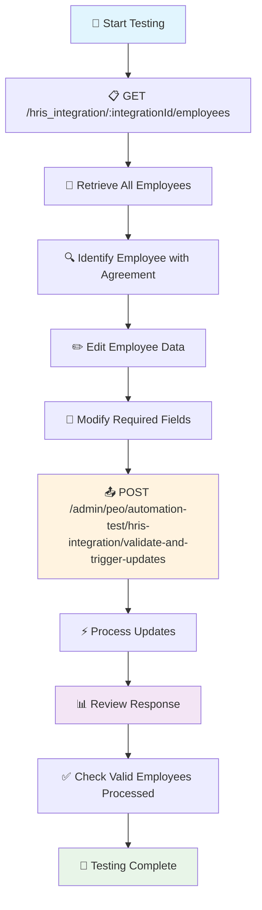

# PEO HRIS Integration Test Endpoint

## Overview

This documentation covers the HRIS Integration Employee Management endpoints that allow you to retrieve employee data from connected HRIS systems and create PEO agreements for selected employees.

# Setting Up HRIS Integration

1. **HRIS Connection**: Complete the setup process for your chosen HRIS system (detailed below)
2. **Extract Integration ID**: Copy the integration ID from the URL or integration settings page (detailed below)
3. **Create Agreements**: Proceed with the Mass PEO Employee Agreement Creation workflow (detailed below)

---
## How to Connect with HRIS Systems
Before using these endpoints, you must connect your HRIS system to your Deel organization and obtain an integration ID.

#### HiBob Integration Example

To connect your HiBob HRIS system to Deel:

1. **Navigate to Apps**: Go to the Apps section in your Deel dashboard
2. **Select HiBob**: Find and click on the HiBob integration option
3. **Continue Setup**: Click "Continue Setup" to start the configuration process
4. **Fill Authentication Form**: Provide the required credentials:
   - **User Service ID**: Your HiBob user service identifier
   - **Token**: Your HiBob API authentication token
5. **Complete Setup**: Click "Continue" to finalize the integration

#### Obtaining Your Integration ID

Once the integration is successfully connected, your `integrationId` will be available in the URL:

```
.../integrations/hibob/plugins?id=YOUR_INTEGRATION_ID
```

**Example URL:**
```
https://app.deel.com/integrations/hibob/plugins?id=abc123-def456-ghi789-012345
```

In this example, `abc123-def456-ghi789-012345` is your integration ID that you'll use in the API endpoints.

---

## Create Agreement
We will need a valid agreement to perform the updates

### Mass PEO Employee Agreement Creation

The integration provides a manual workflow for creating PEO agreements using HRIS employee profiles:

#### Phase 1: Employee Selection and Agreement Creation

Clients can access their connected HRIS (e.g., HiBob) through the Deel platform to:

- **View Employee List**: See all employees from the connected HRIS system
- **Select Employees**: Manually select which employees to create agreements for
- **Create Agreements**: Click "Create agreement" to generate PEO agreements
- **Draft Creation**: Agreements are created as drafts with basic employee information

#### Phase 2: Agreement Completion

After agreement creation, clients must complete the agreements:

- **Completion Notification**: Popup confirms "PEO agreements have been created" with draft status
- **Action Options**: Clients can choose "Complete agreement" or "Later"
- **Detail Completion**: When completing agreements, clients add missing details
- **Employee Invitation**: Once completed, employees are invited to the Deel platform

---

# PEO HRIS Integration Test Endpoint

Once you have completed the UI workflow and have an integration ID:

1. **Retrieve Employees**: Use the GET endpoint to fetch employee data from your HRIS integration
2. **Edit Employee Data**: Modify the retrieved employee data as needed for your requirements
3. **PEO HRIS Integration**: Trigger PEO HRIS integration updates

## Endpoints

### 1. GET `/hris_integration/:integrationId/employees`

Retrieves employee data from a connected HRIS integration.

#### Parameters

**Path Parameters:**
- `integrationId` (string, required): The unique identifier for the HRIS integration

**Query Parameters:**
- `cursor` (string, optional): Pagination cursor for retrieving additional employees

#### Response

Returns a paginated list of employees with the following structure:

```json
{
  "employees": [
    {
      "organizationId": 12345,
      "integrationId": "abc123-def456-ghi789",
      "hrisIntegrationProviderId": "emp_001",
      "externalId": "EXT_001",
      "clientLegalEntityId": "le_123",
      "payrollSettingsId": "ps_456",
      "employeeEmail": "john.doe@company.com",
      "employeeNationality": "US",
      "salary": 75000,
      "currency": "USD",
      "employmentState": "CA",
      "personalEmail": "john.personal@email.com",
      "peoStartDate": "2024-01-15T00:00:00.000Z",
      "personalPhone": "+1-555-0123",
      "employeeFirstName": "John",
      "employeeLastName": "Doe",
      "ssn": "***-**-1234",
      "seniority": "Senior",
      "employeeAddress": {
        "country": "US",
        "street": "123 Main St",
        "city": "San Francisco",
        "state": "CA",
        "zip": "94102",
        "phone": "+1-555-0123",
        "callingCode": "+1"
      },
      "manager": {
        "name": "Jane Smith",
        "email": "jane.smith@company.com"
      },
      "jobTitle": "Software Engineer",
      "employmentType": "FULL_TIME",
      "startDate": "2024-01-15T00:00:00.000Z",
      "workEmail": "john.doe@company.com",
      "employeeNeedToTravel": false,
      "isClericalPosition": false,
      "workHours": 40,
      "groups": [],
      "bankInfo": [],
      "employments": [],
      "jobs": [],
      "flsa": "exempt",
      "compensations": [],
      "payrollGroup": [],
      "payMethod": "DIRECT_DEPOSIT",
      "workHoursPerWeek": 40
    }
  ],
  "cursor": "next_page_cursor_123"
}
```

#### Usage Example

```bash
curl -X GET "https://<YOUR_ENV_URL>/deelapi/peo_integration/hris_integration/abc123-def456-ghi789/employees?cursor=page_2" \
  -H "x-auth-token: Bearer YOUR_TOKEN" \
  -H "Content-Type: application/json"
```

---

### 2. POST `/admin/peo/automation-test/hris-integration/validate-and-trigger-updates`

Validates and triggers HRIS integration updates for PEO testing. This endpoint receives an array of employees, validates their presence in integrations and either publishes integration update events (async) or directly processes them synchronously based on the sync query parameter.

#### Parameters

**Query Parameters:**
- `sync` (boolean, optional): If false or omitted, sends a NATS message to `peo.peohrisintegrationupdate` for asynchronous processing. If true, executes `peo.peohrisintegrationupdate` processor synchronously.
> **Note**: `peo.peohrisintegrationupdatedomain` events are still processed asynchronously regardless of the sync parameter.

**Request Body:**
```json
{
  "employees": [
    {
      "integrationId": "17556fa4-5320-4a5c-b52a-041336380eb5", // Required - UUID
      "organizationId": 239991, // Required - Number
      "clientLegalEntityId": "448af53f-ab45-41b2-9d47-b42493135706", // Required - String
      "hrisIntegrationProviderId": "2693051198667228051", // Required - String
      "employeeFirstName": "Malcy", // Required - String
      "employeeLastName": "Farishyy", // Required - String
      "employeeEmail": "malcolm.farish_474338@samplebob.com", // Required - Valid email

      // Optional fields
      "payrollSettingsId": "cme3h9127000n01exgazfhnbp",
      "externalId": "2693051198667228051",
      "dob": "1987-07-23",
      "ssn": "123-12-3123",
      "employeeNationality": "United States",
      "salary": 9510,
      "currency": "USD",
      "employmentState": "NY",
      "personalEmail": "malcolm.farish_474338@samplebob.com",
      "peoStartDate": "2015-02-20",
      "personalPhone": "+12025550159",
      "seniority": "Individual contributor",
      "jobTitle": "CEO",
      "employmentType": null,
      "startDate": "2015-02-20",
      "workEmail": "malcolm.farish_474338@samplebob.com",
      "employeeNeedToTravel": false,
      "isClericalPosition": false,
      "workHours": 38,
      "flsa": "exempt",
      "payMethod": "S",
      "workHoursPerWeek": 38,

      "employeeAddress": {
        "country": "United States",
        "state": "NY",
        "city": "New York",
        "street": "2567 GOOD",
        "zip": "10016"
      },

      "manager": {
        "name": "Alicia Green",
        "email": null,
        "providerId": "212121"
      },

      "groups": [
        {
          "name": "Department SUVQ2N",
          "type": "DEPARTMENT",
          "providerId": "264271435"
        }
      ],

      "jobs": [
        {
          "endDate": null,
          "manager": {
            "name": "Alicia Green",
            "email": null,
            "providerId": "212121"
          },
          "division": null,
          "jobTitle": "CEO",
          "location": "Sidney",
          "seniority": "Individual contributor",
          "department": "Department SUVQ2N",
          "providerId": null,
          "workLocation": "Sidney",
          "effectiveDate": "2025-07-11",
          "allocationPercentage": "100"
        }
      ],

      "bankInfo": [
        {
          "id": null,
          "bankName": "1ST AMERICAN STATE BANK OF MINNESOTA",
          "createdAt": null,
          "accountName": "Teste",
          "accountType": "CHECKING",
          "accountNumber": "123123",
          "effectiveDate": null,
          "routingNumber": "091205102"
        }
      ],

      "employments": [
        {
          "hiredAt": "2015-02-20T00:00:00.000Z",
          "payRate": 9510,
          "payType": "ANNUAL",
          "hireDate": null,
          "startsAt": "2015-02-20T00:00:00.000Z",
          "createdAt": null,
          "startDate": "2015-02-20",
          "updatedAt": null,
          "providerId": null,
          "weeklyHours": 38,
          "effectiveDate": "2025-07-11",
          "baseHourlyRate": null,
          "employmentType": null,
          "paymentFrequency": "EVERY_TWO_WEEKS",
          "terminationDetails": {
            "noticePeriod": null,
            "severanceType": null,
            "considerations": null,
            "lastWorkingDay": null,
            "rehireEligible": null,
            "severanceAmount": null,
            "terminationDate": null,
            "terminationType": null,
            "noticePeriodType": null,
            "terminationReason": null,
            "timeOffUnusedDays": null
          }
        }
      ],

      "compensations": [
        {
          "jobId": null,
          "endDate": null,
          "createdAt": null,
          "components": [
            {
              "name": "Part time",
              "value": 9510,
              "payType": "ANNUAL",
              "currency": "USD",
              "paymentFrequency": "EVERY_TWO_WEEKS"
            }
          ],
          "providerId": null,
          "changeReason": null,
          "effectiveDate": "2015-02-20",
          "paymentNature": null
        }
      ],

      "payrollGroup": [
        {
          "id": "Australia",
          "name": "Australia",
          "effectiveDate": null
        }
      ]
    }
  ]
}
```

#### Field Validation

**Required Fields:**
- `integrationId`: UUID string for the HRIS integration
- `organizationId`: Numeric organization identifier
- `clientLegalEntityId`: String identifier for the legal entity
- `hrisIntegrationProviderId`: Unique identifier from HRIS system
- `employeeFirstName`: Employee's first name
- `employeeLastName`: Employee's last name
- `employeeEmail`: Valid email address

#### Response

Returns validation results and processing status:

```json
{
  "success": true,
  "processedCombinations": 1,
  "validationResults": {
    "239991_17556fa4-5320-4a5c-b52a-041336380eb5": {
      "totalEmployees": 1,
      "validEmployeesHrisIntegrationProviderId": ["2693051198667228051"],
      "invalidEmployeesHrisIntegrationProviderId": [],
      "messagePublished": true,
      "syncProcessingResult": {
        "success": true,
        "errors": []
      }
    }
  },
  "processingTime": 2045,
  "errors": [],
  "syncMode": true,
  "syncErrors": []
}
```

#### Response Fields

- `success`: Boolean indicating overall operation success
- `processedCombinations`: Number of organization-integration combinations processed
- `validationResults`: Object containing results per organization-integration combination
- `processingTime`: Total processing time in milliseconds
- `errors`: Array of any validation or processing errors
- `syncMode`: Boolean indicating if sync mode was used
- `syncErrors`: Array of errors from synchronous processing (when sync=true)

#### Usage Example

```bash
curl --location 'https://<YOUR_ENV_URL>/admin/peo/automation-test/hris-integration/validate-and-trigger-updates?sync=true' \
--header 'accept: application/json, text/plain, */*' \
--header 'x-auth-token: YOUR_ADMIN_TOKEN' \
--header 'x-request-id: 12345' \
--header 'Content-Type: application/json' \
--data-raw '{
    "employees": [
        {
            "integrationId": "17556fa4-5320-4a5c-b52a-041336380eb5",
            "organizationId": 239991,
            "clientLegalEntityId": "448af53f-ab45-41b2-9d47-b42493135706",
            "hrisIntegrationProviderId": "2693051198667228051",
            "employeeFirstName": "John",
            "employeeLastName": "Doe",
            "employeeEmail": "john.doe@company.com",
            "salary": 75000,
            "currency": "USD",
            "jobTitle": "Software Engineer"
        }
    ]
}'
```

#### Processing Modes

**Asynchronous Mode (default):**
- Set `sync=false` or omit the sync parameter
- Publishes integration update events for background processing
- Faster response time
- Replicates better the production usage

**Synchronous Mode:**
- Set `sync=true`
- Processes updates immediately and returns detailed results
- Slower response time but immediate feedback
- Useful for testing and debugging

---

## Testing Workflow

The following workflow demonstrates how to test PEO HRIS integration updates using the documented endpoints:

### Step-by-Step Process

1. **Retrieve Employee Data**: Use the GET endpoint to fetch employee details from your connected HRIS integration
2. **Edit Employee Information**: Modify the retrieved employee data according to your testing requirements
3. **Trigger Integration Updates**: Send the edited data to the validation endpoint to process the updates

### Workflow Diagram




### Pro Tip: Bulk Testing

> **💡 Tip**: You can send **all employees** returned by the GET endpoint to the validation endpoint. The response will clearly indicate which employees were valid and processed:
>
> ```json
> {
>   "validationResults": {
>     "orgId_integrationId": {
>       "validEmployeesHrisIntegrationProviderId": ["emp_001", "emp_002"],
>       "invalidEmployeesHrisIntegrationProviderId": ["emp_003"]
>     }
>   }
> }
> ```
>
> This approach helps you:
> - Identify which employees have valid agreements
> - Test multiple employees simultaneously
> - Understand validation rules without manual filtering

### Expected Outcome

After completing this workflow, you should receive a response indicating:

- ✅ **Success**: Your target employee was found and processed
- 📊 **Validation Results**: Clear breakdown of valid vs invalid employees
- ⚡ **Processing Status**: Whether updates were applied (sync mode) or queued (async mode)
- 🔍 **Detailed Feedback**: Any errors or issues encountered during processing

---

## Related Documentation

- [Main HRIS Integration Documentation](README.md)
- [HiBob Testing Guide](hibob_testing_guide.md)
- [Module Overview](module_overview.md)

---

_Created: 2025-12-18_  
_Last Updated: 2025-12-18_  
_Maintained By: PEO Engineering Team_
