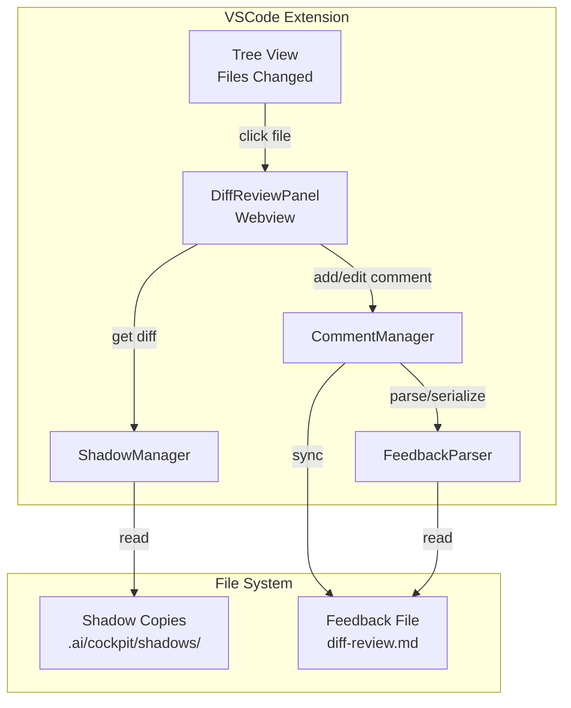
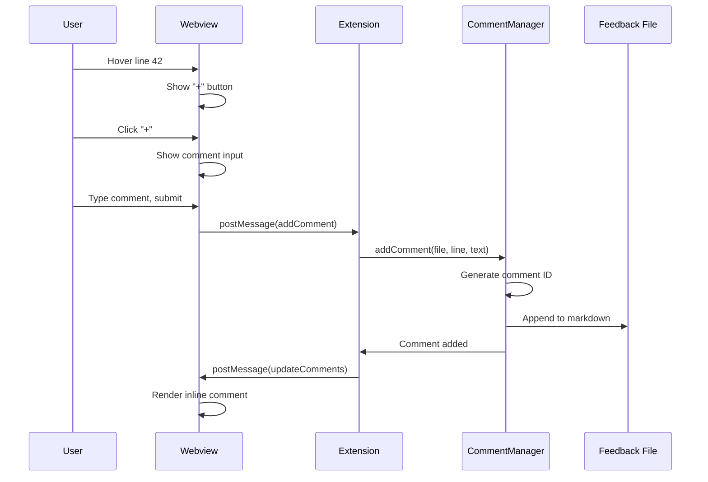
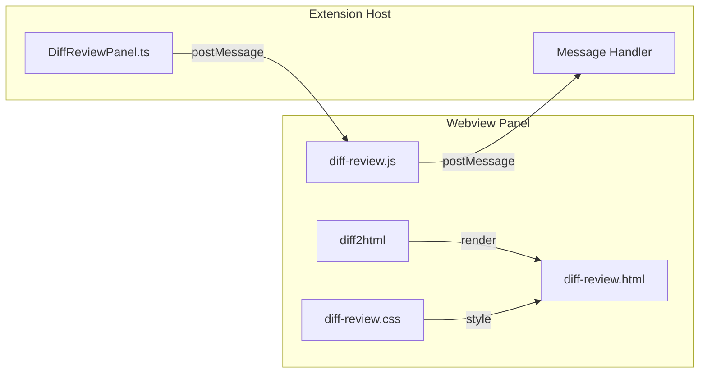

> Parent: [[task-index]]

# LOCAL-014: GitHub-style PR review diff viewer

## Problem Statement

Users want to add inline comments on diff views like GitHub PR reviews. Currently, the AI Cockpit uses VSCode's native `vscode.diff` command which doesn't support comment annotations. Users must manually edit a markdown file with file:line references, which is cumbersome compared to clicking directly on diff lines.

The goal is to replace the native diff viewer with a custom webview that renders diffs using diff2html and allows inline commenting with a GitHub-familiar UX (hover → "+" button → comment input).

## Acceptance Criteria

- [ ] Click "+" button on any diff line to add inline comment
- [ ] Comments display inline in diff view (like GitHub PR reviews)
- [ ] Comments sync bidirectionally to `feedback/diff-review.md`
- [ ] `/address-feedback` command can read structured comments with metadata
- [ ] Works with existing shadow copy system (baseline → accumulated)
- [ ] Matches VSCode theme (light/dark)
- [ ] Supports line ranges (e.g., lines 42-50)
- [ ] Resolved comments show with strikethrough

## Work Items

| ID | Name | Repo | Status |
|----|------|------|--------|
| 01 | Enhanced feedback format design | ai-framework | todo |
| 02 | Feedback parsing library | ai-framework | todo |
| 03 | DiffReviewPanel webview scaffold | vscode-extension | todo |
| 04 | Integrate diff2html rendering | vscode-extension | todo |
| 05 | Comment UI overlay system | vscode-extension | todo |
| 06 | CommentManager service | vscode-extension | todo |
| 07 | Wire tree view to webview | vscode-extension | todo |
| 08 | Styling and polish | vscode-extension | todo |

## Branches

| Repo | Branch |
|------|--------|
| ai-framework | `LOCAL-014-pr-review-diff` |
| vscode-extension | `LOCAL-014-pr-review-diff` |

## Technical Context

### Current Architecture
- Shadow copies stored in `.ai/cockpit/shadows/{taskId}/{hash}/`
- Each shadow has: `baseline.txt`, `accumulated.txt`, `meta.json`
- Diff viewing uses `vscode.diff` command with virtual document providers
- Feedback stored in `.ai/tasks/{taskId}/feedback/diff-review.md`

### Key Files
- `vscode-extension/src/services/DiffViewer.ts` - Current diff logic
- `vscode-extension/src/services/ShadowManager.ts` - Shadow data source
- `vscode-extension/src/providers/TaskTreeProvider.ts` - Tree view integration
- `.ai/_framework/templates/feedback-template.md` - Current feedback format

### Technology Choice: diff2html
Chosen over Monaco Editor because:
- Smaller bundle (~50KB vs ~2MB)
- GitHub-familiar UX out of the box
- Easier DOM injection for comment widgets
- Goal is review/commenting, not editing

## Architecture Diagrams

### Component Overview

### Message Flow: Adding a Comment

### Webview Architecture

## Implementation Approach

### Phase 1: Foundation (WI 01-03)
1. Define enhanced feedback format with metadata
2. Create parsing library for structured comments
3. Scaffold webview panel with message passing

### Phase 2: Core Features (WI 04-06)
1. Integrate diff2html for diff rendering
2. Build comment UI overlay (hover button, input, display)
3. Implement CommentManager for CRUD and file sync

### Phase 3: Integration & Polish (WI 07-08)
1. Wire tree view to open webview instead of native diff
2. Style to match VSCode themes, add keyboard shortcuts

## Risks & Considerations

| Risk | Mitigation |
|------|------------|
| Line numbers shift after edits | Store file hash, warn if stale |
| Theme mismatch | Custom CSS variables matching VSCode |
| External edit conflicts | File watcher with debounced reload |
| Bundle size | Lazy-load diff2html only when panel opens |

## Testing Strategy

### Unit Tests
- FeedbackParser: Parse/serialize markdown correctly
- CommentManager: CRUD operations, file sync

### Integration Tests
- Webview loads with correct diff
- Comment added → appears in markdown
- External edit → webview updates

### Manual Testing
1. Open diff review with 0 comments
2. Add comment on specific line
3. Add comment on line range
4. Resolve comment (verify strikethrough)
5. Switch themes (verify colors)
6. Run `/address-feedback` (verify agent sees comments)

## Feedback

Review comments can be added to `feedback/diff-review.md`.
Use `/address-feedback` to discuss feedback with the agent.

## References

- [diff2html documentation](https://diff2html.xyz/)
- [VSCode Webview API](https://code.visualstudio.com/api/extension-guides/webview)
- Existing shadow system: `.ai/docs/_architecture/shadow-copy-system.md`

## Linked Work Items
- [[03-diff-review-panel-scaffold]] — DiffReviewPanel webview scaffold (done)
- [[03-[[diff-review]]-panel-scaffold]] — DiffReviewPanel webview scaffold (done)
- [[03-[[diff-review]]-panel-scaffold]] — DiffReviewPanel webview scaffold (done)
- [[03-[[diff-review]]-panel-scaffold]] — DiffReviewPanel webview scaffold (done)
- [[03-[[diff-review]]-panel-scaffold]] — DiffReviewPanel webview scaffold (done)
- [[03-[[diff-review]]-panel-scaffold]] — DiffReviewPanel webview scaffold (done)
- [[03-[[diff-review]]-panel-scaffold]] — DiffReviewPanel webview scaffold (done)

- [[01-enhanced-feedback-format]] — Enhanced feedback format design (done)
- [[02-feedback-parsing-library]] — Feedback parsing library (done)
- [[03-[[diff-review]]-panel-scaffold]] — DiffReviewPanel webview scaffold (done)
- [[04-diff2html-integration]] — Integrate diff2html rendering (done)
- [[05-comment-ui-overlay]] — Comment UI overlay system (done)
- [[06-comment-manager-service]] — CommentManager service (done)
- [[07-wire-tree-view]] — Wire tree view to webview (done)
- [[08-styling-polish]] — Styling and polish (done)
- [[09-fix-watcher-race-condition]] — Fix race condition in file watcher setup (done)
- [[10-fix-circular-update-loop]] — Fix circular update loop in CommentManager (done)
- [[11-fix-memory-leak-listeners]] — Fix memory leak in event listeners (done)
- [[12-fix-xss-comment-rendering]] — Fix XSS vulnerability in comment rendering (done)
- [[13-fix-path-traversal]] — Fix path traversal in work item opening (done)
- [[14-add-ready-error-handling]] — Add error handling for webview ready message (done)
- [[15-implement-cache-eviction]] — Implement cache eviction in CommentManager (done)
- [[16-fix-type-guard-validation]] — Fix type guard for message validation (done)
