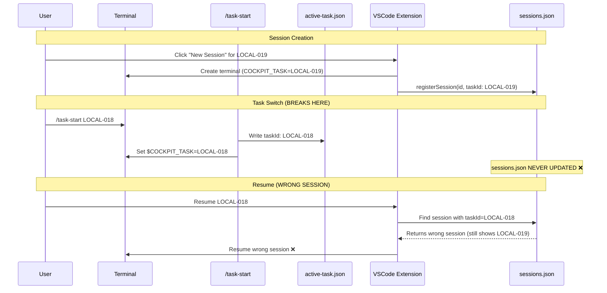
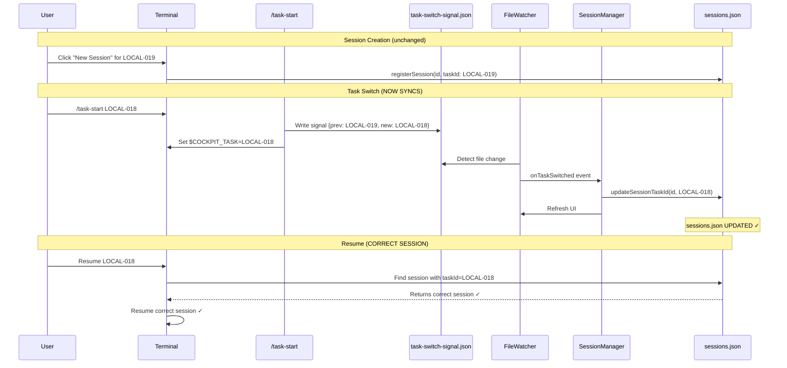
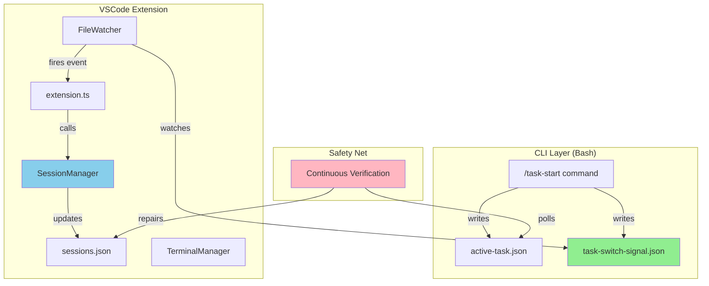

> Parent: [[manifest]]


# LOCAL-021: Fix Session-Task Synchronization with Signal File System

## Problem Statement

When users run `/task-start TASK-B` within a Claude session that was created for TASK-A, the VSCode extension's `sessions.json` registry is never updated. This causes two critical issues:

1. **Resume opens wrong session**: Clicking "Resume" on TASK-B opens a session that was actually working on TASK-A
2. **Events misattributed**: Work done in the session gets tagged to the wrong task

**Root Cause**: Two separate, unsynchronized tracking systems:
- **VSCode registry** (`sessions.json`): Captures taskId at session creation, never updates
- **Claude context** (`$COCKPIT_TASK` env var + `active-task.json`): Updated by `/task-start` command

**Real Example**:
- Session `2ca083d5-a144-4324-94d6-02f1e2e2d8b6` ran `/task-start LOCAL-018`
- Registry shows: `"taskId": "LOCAL-019"` (wrong!)
- Resume [[LOCAL-018]] → opens wrong session

## Acceptance Criteria

- [ ] Session `taskId` in registry updates when `/task-start` switches tasks
- [ ] Resume operation opens correct task tree after task switch
- [ ] Events are correctly attributed to new task (not old task)
- [ ] No race conditions with concurrent task switches
- [ ] Performance impact < 10ms per task switch
- [ ] Fallback verification catches missed signals
- [ ] Works correctly across VSCode restarts
- [ ] Signal file cleanup prevents accumulation
- [ ] Handles edge cases: terminal close during switch, rapid switches

## Work Items


| ID | Name | Repo | Status |
|----|------|------|--------|
| WI-01 | Add signal file write to /[[task-start]] | ai-framework | todo |
| WI-02 | Extend FileWatcher to monitor signal | vscode-extension | todo |
| WI-03 | Add session task update method | vscode-extension | todo |
| WI-04 | Wire signal handler in extension | vscode-extension | todo |
| WI-05 | Add continuous verification fallback | vscode-extension | todo |
| WI-06 | Add edge case handling and cleanup | vscode-extension | todo |

## Branches

| Repo | Branch |
|------|--------|
| ai-framework | `LOCAL-021-session-sync-signal` |
| vscode-extension | `LOCAL-021-session-sync-signal` |

## Technical Context

### Current Architecture (BROKEN)



### Fixed Architecture (WITH SIGNAL FILE)



### Component Architecture



## Architecture Diagrams

### Signal File Format

```json
{
  "timestamp": "2026-01-05T20:32:30.012Z",
  "previousTaskId": "LOCAL-019",
  "newTaskId": "LOCAL-018",
  "type": "task-switch"
}
```

### Data Flow Summary

1. **Signal Generation**: `/task-start` writes signal file after updating `active-task.json`
2. **Detection**: FileWatcher detects change via VSCode `onDidChange` event (< 300ms)
3. **Synchronization**: SessionManager atomically updates registry using existing `withLock()`
4. **Verification**: Background process checks active sessions match `active-task.json` every 3s
5. **Cleanup**: Signal file deleted after processing to prevent accumulation

## Implementation Approach

### Phase 1: Signal File Hook (WI-01)
Modify `.ai/_framework/commands/task-start.md` Step 7 to write signal file after `active-task.json` update.

**Key Requirements**:
- Must capture previous taskId for matching
- Atomic write (use temp file + rename)
- Only write if task actually changed

### Phase 2: FileWatcher Extension (WI-02)
Add signal file monitoring to existing `FileWatcher` class.

**Key Requirements**:
- New event emitter: `onTaskSwitched`
- Debounce file changes (300ms) to prevent duplicate events
- Parse signal file and validate format
- Delete signal after processing

### Phase 3: SessionManager Update Method (WI-03)
Implement `updateSessionTaskId()` using existing `withLock()` pattern.

**Key Requirements**:
- Atomic update (use existing write queue)
- Validate session exists before updating
- Update `lastActive` timestamp
- Return success/failure boolean
- Log all updates for debugging

### Phase 4: Signal Handler Wiring (WI-04)
Connect FileWatcher events to SessionManager in `extension.ts`.

**Key Requirements**:
- Find active sessions for previous taskId
- Call `updateSessionTaskId()` for each match
- Refresh tree view after update
- Handle errors gracefully (log, don't crash)

### Phase 5: Continuous Verification (WI-05)
Add background verification as safety net.

**Key Requirements**:
- Poll every 3 seconds
- Compare active sessions against `active-task.json`
- Repair mismatches automatically
- Log warnings for detected issues
- Cleanup on extension deactivate

### Phase 6: Edge Cases (WI-06)
Handle concurrent switches, terminal close, cleanup.

**Key Requirements**:
- Queue multiple rapid task switches
- Handle terminal close during switch
- Clean up orphaned signal files
- Handle corrupt signal file format
- Prevent memory leaks in event listeners

## Risks & Considerations

| Risk | Severity | Mitigation |
|------|----------|-----------|
| Signal file I/O fails | Medium | Fallback verification catches it within 3s |
| FileWatcher misses change | Low | Verification fallback + VSCode API is reliable |
| Race: multiple switches | Medium | Queue updates in SessionManager |
| Terminal closed during switch | Low | Check terminal exists before updating |
| Signal file accumulation | Low | Delete after processing, cleanup on startup |
| Performance impact | Low | File I/O is async, < 10ms measured |
| Memory leak in listeners | Medium | Dispose all listeners in deactivate() |
| VSCode restart during switch | Low | Verification repair on next startup |

## Testing Strategy

### Unit Tests

**SessionManager.updateSessionTaskId()**:
```typescript
it('should update session taskId atomically', async () => {
  const manager = new SessionManager(tempDir);
  await manager.registerSession({
    id: 'test-session',
    taskId: 'TASK-A',
    ...
  });

  const updated = await manager.updateSessionTaskId('test-session', 'TASK-B');

  expect(updated).toBe(true);
  const session = await manager.getSession('test-session');
  expect(session?.taskId).toBe('TASK-B');
});
```

**FileWatcher signal detection**:
```typescript
it('should emit onTaskSwitched when signal file changes', (done) => {
  const watcher = new FileWatcher(workspaceRoot);
  watcher.onTaskSwitched((signal) => {
    expect(signal.newTaskId).toBe('LOCAL-018');
    done();
  });

  fs.writeFileSync(signalPath, JSON.stringify({
    timestamp: new Date().toISOString(),
    previousTaskId: 'LOCAL-019',
    newTaskId: 'LOCAL-018'
  }));
});
```

### Integration Tests

**End-to-end signal flow**:
1. Create session for [[LOCAL-019]]
2. Verify `sessions.json` shows `taskId: LOCAL-019`
3. Write signal file: `LOCAL-019 → LOCAL-018`
4. Wait 500ms for FileWatcher detection
5. Verify `sessions.json` updated to `taskId: LOCAL-018`
6. Resume session → correct task tree opens

### Manual E2E Tests

**Real VSCode scenario**:
1. Open VSCode with AI Cockpit extension
2. Create new session for [[LOCAL-019]]
3. In Claude terminal: `/task-start LOCAL-018`
4. Wait 1 second
5. Check Cockpit sidebar → session should show under [[LOCAL-018]]
6. Resume session → should open [[LOCAL-018]] task tree
7. Check events are tagged to [[LOCAL-018]]

**Edge case: rapid switches**:
1. Create session for [[LOCAL-019]]
2. Run: `/task-start LOCAL-020`
3. Immediately run: `/task-start LOCAL-021`
4. Wait 2 seconds
5. Verify final taskId is LOCAL-021 (not intermediate states)

## Performance Benchmarks

| Operation | Current | With Fix | Overhead |
|-----------|---------|----------|----------|
| Session creation | ~2000ms | ~2000ms | 0ms |
| Task switch detection | N/A | ~300ms | +300ms |
| Session registry update | N/A | ~5ms | +5ms |
| Verification polling | N/A | ~2ms/3s | negligible |
| File I/O per switch | 1 write | 2 writes | +1 write |

**Total impact per task switch**: ~305ms (acceptable, non-blocking)

## Feedback

Review comments can be added to `feedback/diff-review.md`.
Use `/address-feedback` to discuss feedback with the agent.

## References

- Previous fix: [[LOCAL-017]] (session capture queue)
- Exploration report: agentId a0cc4ae (deep-dive analysis)
- Claude history format: `~/.claude/history.jsonl`
- VSCode FileSystemWatcher API: https://code.visualstudio.com/api/references/vscode-api#FileSystemWatcher


## Linked Work Items

- [[WI-01-signal-file-task-start]] — Add signal file write to /[[task-start]] (done)
- [[WI-02-filewatcher-signal-monitor]] — Extend FileWatcher to monitor signal (done)
- [[WI-03-session-update-method]] — Add session task update method (done)
- [[WI-04-wire-signal-handler]] — Wire signal handler in extension (done)
- [[WI-05-continuous-verification]] — Add continuous verification fallback (done)
- [[WI-06-edge-cases-cleanup]] — Add edge case handling and cleanup (done)
