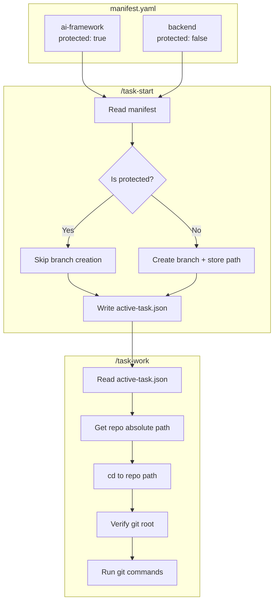

> Parent: [[task-index]]


# LOCAL-026: Git Context Persistence and Repo Protection

## Problem Statement

Agents lose track of which repository they're working in, especially in nested repo scenarios (e.g., `ai-framework` contains `backend` as a nested repo). This causes:

1. **Commits to wrong repos**: Agent commits to wrapper repo instead of target repo
2. **Branch creation in protected repos**: Agent creates task branches in the framework repo when it should only create them in work repos
3. **Missing path context**: Only repo names are stored, not absolute paths
4. **No verification before git ops**: Agent runs git commands without confirming correct working directory

### Real-world Example

```
Structure:
  /Users/.../deel (ai-framework wrapper repo)
  /Users/.../deel/backend (nested letsdeel/backend repo)

What happened:
  1. Agent edited file in backend/
  2. Agent ran `git add` from parent directory
  3. Commit went to ai-framework repo instead of backend repo
  4. Agent confused by `git rev-parse --show-toplevel` returning parent
```

## Acceptance Criteria

- [ ] Repos can be marked as `protected: true` in manifest
- [ ] Protected repos NEVER get task branches created
- [ ] `active-task.json` stores absolute paths for each affected repo
- [ ] Work items include `repo_path` in YAML frontmatter
- [ ] Pre-git verification step exists before any git operation
- [ ] Agent receives clear warnings when attempting protected repo operations
- [ ] Nested repo scenarios are handled correctly

## Work Items


| ID | Name | Repo | Status |
|----|------|------|--------|
| 01 | Add protected flag to manifest schema | ai-framework | todo |
| 02 | Update [[task-start]] branch creation | ai-framework | todo |
| 03 | Update [[task-create]] to exclude protected repos | ai-framework | todo |
| 04 | Enhance active-task.json schema | ai-framework | todo |
| 05 | Add git guardrails to [[task-work]] | ai-framework | todo |
| 06 | Update [[work-item]] template | ai-framework | todo |

## Branches

| Repo | Branch |
|------|--------|
| ai-framework | `project/ai-cockpit` (existing - no new branch needed) |

## Technical Context

### Key Files to Modify

- `.ai/_project/manifest.yaml` - Add `protected` field schema
- `.ai/_framework/commands/task-start.md` - Lines 248-256 (branch creation)
- `.ai/_framework/commands/task-create.md` - Lines 325-331 (branches table)
- `.ai/_framework/commands/task-work.md` - Lines 298-315 (commit section)
- `.ai/_framework/templates/work-item.md` - Lines 15-17 (YAML frontmatter)
- `.ai/cockpit/active-task.json` - Schema enhancement

### Current active-task.json Schema

```json
{
  "taskId": "LOCAL-024",
  "title": "...",
  "branch": "project/ai-cockpit",
  "frameworkPath": ".ai/tasks/in_progress/LOCAL-024",
  "startedAt": "...",
  "sessionId": "..."
}
```

### Proposed active-task.json Schema

```json
{
  "taskId": "LOCAL-026",
  "title": "...",
  "frameworkPath": ".ai/tasks/in_progress/LOCAL-026",
  "startedAt": "...",
  "sessionId": "...",
  "affectedRepos": [
    {
      "name": "backend",
      "absolutePath": "/Users/.../deel/backend",
      "gitRoot": "/Users/.../deel/backend",
      "branch": "JIRA-123-fix",
      "remote": "origin",
      "remoteUrl": "git@github.com:user/backend.git",
      "protected": false
    }
  ],
  "currentWorkRepo": "backend"
}
```

### Proposed Manifest Schema

```yaml
repos:
  - name: ai-framework
    path: ./
    protected: true           # NEW: Never create task branches
    locked_branch: project/ai-cockpit  # NEW: Always stay on this branch
    description: "..."

  - name: backend
    path: /absolute/path/to/backend
    git_root: /absolute/path/to/backend  # NEW: For nested repos
    protected: false          # Default
    description: "..."
```

## Implementation Approach

1. **Schema first**: Define the new manifest and active-task.json schemas
2. **Protection layer**: Implement protected repo checks in [[task-start]]
3. **Context persistence**: Store absolute paths at task start time
4. **Guardrails**: Add verification step before git operations
5. **Template updates**: Enhance [[work-item]] frontmatter

## Architecture Diagram



## Risks & Considerations

- **Backward compatibility**: Existing tasks without new fields should still work
- **Path resolution**: Relative paths in manifest need to resolve correctly
- **Multi-machine**: Absolute paths are machine-specific (consider relative option)

## Testing Strategy

1. Create a task affecting both protected and unprotected repos
2. Verify protected repo gets NO branch created
3. Verify unprotected repo gets branch with correct absolute path
4. Verify git commands run in correct directory
5. Test nested repo scenario end-to-end

## Feedback

Review comments can be added to `feedback/diff-review.md`.
Use `/address-feedback` to discuss feedback with the agent.

## References

- Exploration findings from `/task-explore` on 2026-01-08
- Agent confusion incident report (nested repo commit to wrong target)


## Linked Work Items
- [[02-task-start-branch-protection]] — Update task-start branch creation (done)
- [[03-task-create-exclude-protected]] — Update task-create to exclude protected repos (done)
- [[05-task-work-git-guardrails]] — Add git guardrails to task-work (done)
- [[06-work-item-template]] — Update work-item template (done)
- [[02-[[task-start]]-branch-protection]] — Update task-start branch creation (done)
- [[03-[[task-create]]-exclude-protected]] — Update task-create to exclude protected repos (done)
- [[05-[[task-work]]-git-guardrails]] — Add git guardrails to task-work (done)
- [[06-[[work-item]]-template]] — Update work-item template (done)
- [[02-[[task-start]]-branch-protection]] — Update task-start branch creation (done)
- [[03-[[task-create]]-exclude-protected]] — Update task-create to exclude protected repos (done)
- [[05-[[task-work]]-git-guardrails]] — Add git guardrails to task-work (done)
- [[06-[[work-item]]-template]] — Update work-item template (done)
- [[02-[[task-start]]-branch-protection]] — Update task-start branch creation (done)
- [[03-[[task-create]]-exclude-protected]] — Update task-create to exclude protected repos (done)
- [[05-[[task-work]]-git-guardrails]] — Add git guardrails to task-work (done)
- [[06-[[work-item]]-template]] — Update work-item template (done)

- [[01-manifest-protected-flag]] — Add protected flag to manifest schema (done)
- [[02-[[task-start]]-branch-protection]] — Update task-start branch creation (done)
- [[03-[[task-create]]-exclude-protected]] — Update task-create to exclude protected repos (done)
- [[04-active-task-schema]] — Enhance active-task.json schema (done)
- [[05-[[task-work]]-git-guardrails]] — Add git guardrails to task-work (done)
- [[06-[[work-item]]-template]] — Update work-item template (done)
