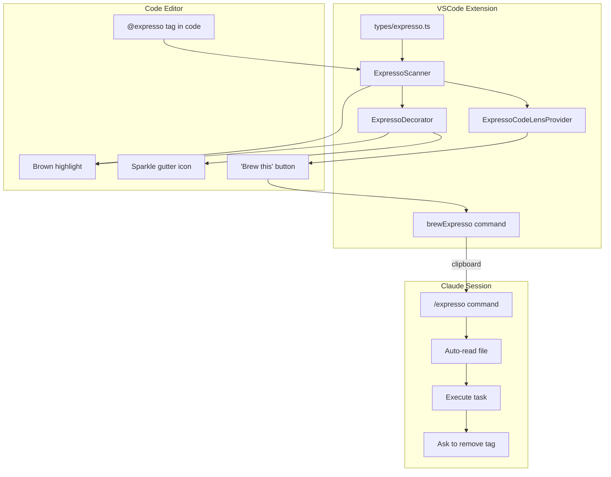
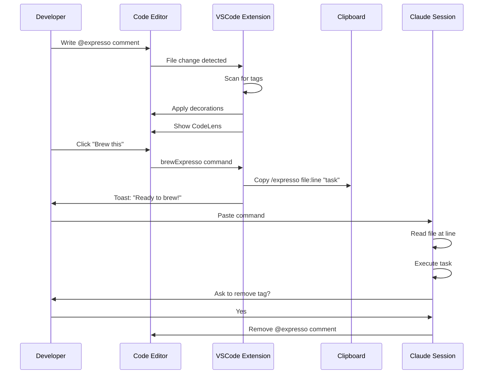

> Parent: [[manifest]]


# LOCAL-027: Implement @expresso in-code task tags

## Problem Statement

Users need a way to annotate code with inline tasks that integrate directly with Claude Code sessions. The current code review system uses separate feedback files which creates friction. Instead, developers should be able to write `@expresso` tags directly in code comments, see them highlighted with visual flair, and execute them with a single click.

**Key User Story:**
1. Developer writes `// @expresso add error handling here` in their code
2. The tag is highlighted with a brown background and animated sparkle icon
3. A "Brew this" button appears above the line
4. Click copies `/expresso file:line "task"` to clipboard
5. Paste in Claude session, Claude auto-reads and executes
6. After completion, Claude asks to remove the tag

## Acceptance Criteria

- [ ] `@expresso`, `@expresso!`, `@expresso?` variants detected in code comments
- [ ] Tags highlighted with coffee-brown background tint
- [ ] Animated sparkle/shine gutter icon displayed
- [ ] "Brew this" CodeLens button appears above each tag
- [ ] Clicking button copies `/expresso path:line "task"` to clipboard
- [ ] Toast notification: "Ready to brew! Paste in terminal"
- [ ] `/expresso` command in Claude auto-reads file at specified line
- [ ] Claude executes the task described in the tag
- [ ] After completion, Claude asks "Remove @expresso tag? (y/n)"
- [ ] If yes, Claude removes the tag from the code

## Work Items


| ID | Name | Repo | Status |
|----|------|------|--------|
| 01 | Type Definitions for ExpressoTag | vscode-extension | todo |
| 02 | ExpressoScanner Service | vscode-extension | todo |
| 03 | ExpressoDecorator Service | vscode-extension | todo |
| 04 | ExpressoCodeLensProvider | vscode-extension | todo |
| 05 | Clipboard and Toast Functionality | vscode-extension | todo |
| 06 | Framework Command /expresso | ai-framework | todo |
| 07 | Integration and Testing | vscode-extension | todo |

## Branches

| Repo | Branch |
|------|--------|
| ai-framework | `LOCAL-027-expresso-tags` |

## Technical Context

### Tag Syntax
```javascript
// @expresso do something              // Single line
/* @expresso do something */           // Block
# @expresso do something               // Python/Ruby/YAML
<!-- @expresso do something -->        // HTML/Markdown
```

### Tag Variants
| Variant | Meaning | Visual |
|---------|---------|--------|
| `@expresso` | Normal task | Brown background |
| `@expresso!` | Urgent/priority | Orange-red tint |
| `@expresso?` | Question/discussion | Blue tint |

### Visual Design
- Background: `rgba(139, 90, 43, 0.15)` (coffee brown, 15% opacity)
- Gutter icon: Animated GIF with sparkle/shine effect
- CodeLens text: "Brew this"

### Clipboard Format
```
/expresso src/api/users.ts:42 "add input validation"
```

### Existing Patterns to Follow
- **Service pattern**: `vscode-extension/src/services/CommentManager.ts`
- **Type definitions**: `vscode-extension/src/types/feedback.ts`
- **File watching**: `vscode-extension/src/watchers/FileWatcher.ts`
- **Command framework**: `.ai/_framework/commands/task-start.md`

## Architecture Diagrams

### Component Flow


### Data Flow


## Implementation Approach

1. **Foundation First**: Create type definitions establishing the data model
2. **Core Service**: Build ExpressoScanner with caching and file watching
3. **Visual Layer**: Implement decorator (parallel with CodeLens)
4. **Interaction**: Add CodeLens and clipboard functionality
5. **Claude Integration**: Create /expresso framework command
6. **Polish**: Integration testing and documentation

## Risks & Considerations

- **Performance**: Scanning large codebases could be slow. Mitigation: Limit scan to open files + incremental updates
- **Regex edge cases**: Comments vary by language. Mitigation: Start with common languages, expand later
- **Animated GIFs**: May not render in all VSCode themes. Mitigation: Test across themes, provide fallback static icon
- **Tag removal**: Need to handle multi-line comments carefully. Mitigation: Parse comment structure, not just regex

## Testing Strategy

1. **Unit tests**: Scanner regex patterns for all comment styles
2. **Unit tests**: Clipboard format generation
3. **Integration tests**: Full flow from tag to clipboard
4. **Manual testing**: Visual appearance across themes
5. **E2E test**: Full flow with Claude session

## Feedback

Review comments can be added to `feedback/diff-review.md`.
Use `/address-feedback` to discuss feedback with the agent.

## References

- VSCode Decorations API: https://code.visualstudio.com/api/references/vscode-api#TextEditorDecorationType
- VSCode CodeLens API: https://code.visualstudio.com/api/references/vscode-api#CodeLensProvider
- Existing service patterns in this repo


## Linked Work Items
- [[08-remove-diff-review-panel]] — Remove DiffReviewPanel (done)
- [[08-remove-[[diff-review]]-panel]] — Remove DiffReviewPanel (done)
- [[08-remove-[[diff-review]]-panel]] — Remove DiffReviewPanel (done)

- [[01-type-definitions]] — Type Definitions for ExpressoTag (done)
- [[02-expresso-scanner]] — ExpressoScanner Service (done)
- [[03-expresso-decorator]] — ExpressoDecorator Service (done)
- [[04-codelens-provider]] — ExpressoCodeLensProvider (done)
- [[05-clipboard-toast]] — Clipboard and Toast Functionality (done)
- [[06-framework-command]] — Framework Command /expresso (done)
- [[07-integration-testing]] — Integration and Testing (done)
- [[08-remove-[[diff-review]]-panel]] — Remove DiffReviewPanel (done)
- [[09-remove-review-changes-command]] — Remove Review Changes Command (done)
- [[10-update-treeview-context-menu]] — Update TreeView Context Menu (done)
