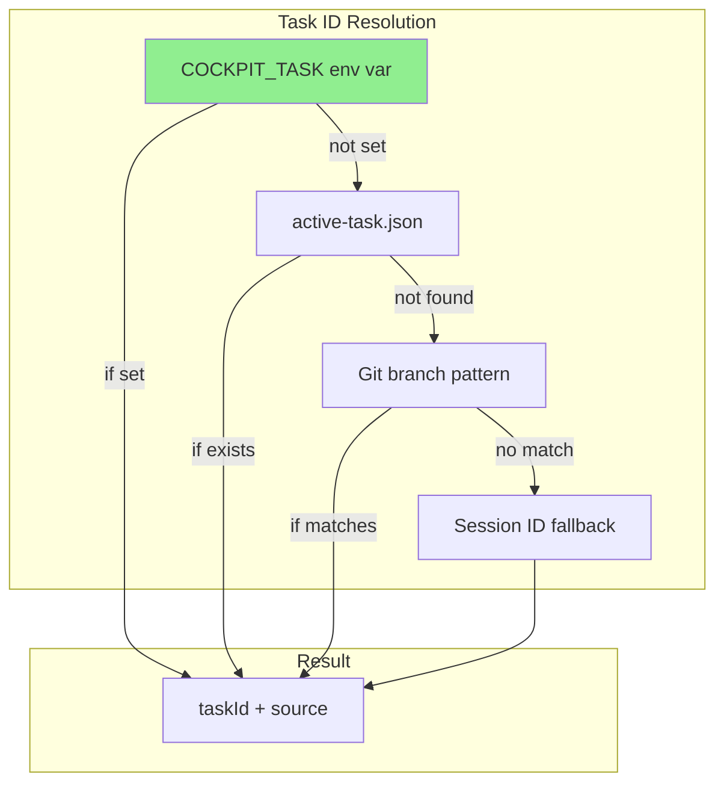

<!--
╔══════════════════════════════════════════════════════════════════╗
║ LAYER: TASK                                                      ║
║ LOCATION: .ai/tasks/in_progress/LOCAL-005/                              ║
╠══════════════════════════════════════════════════════════════════╣
║ BEFORE WORKING ON THIS TASK:                                     ║
║ 1. Read .ai/_project/manifest.yaml (know repos & MCPs)           ║
║ 2. Read this entire README first                                 ║
║ 3. Check which work items are in todo/ vs done/                  ║
║ 4. Work on ONE item at a time from todo/                         ║
╚══════════════════════════════════════════════════════════════════╝
-->

# LOCAL-005: Session-to-Task Binding for Parallel Work

## Problem Statement

Currently, all Claude CLI sessions route their edits to a single active task determined by `active-task.json`. This prevents users from running multiple parallel Claude sessions, each working on different tasks simultaneously.

**Current behavior**:
- Terminal A runs `claude` → edits go to active-task.json task
- Terminal B runs `claude` → edits go to same active-task.json task

**Desired behavior**:
- Terminal A: `COCKPIT_TASK=LOCAL-001 claude` → edits go to LOCAL-001
- Terminal B: `COCKPIT_TASK=LOCAL-002 claude` → edits go to LOCAL-002

## Acceptance Criteria

- [ ] `COCKPIT_TASK` environment variable overrides all other task resolution methods
- [ ] Two parallel Claude sessions with different env vars route edits independently
- [ ] Without env var set, existing behavior is preserved (active-task.json → git branch → session)
- [ ] Event files include `taskIdSource: 'env-var'` when env var is used
- [ ] TypeScript compiles without errors with new source type
- [ ] Documentation updated with new resolution chain

## Work Items

See `status.yaml` for full index.

| ID | Name | Repo | Status |
|----|------|------|--------|
| 01 | Hook env var support | ai-framework | todo |
| 02 | TypeScript type update | vscode-extension | todo |
| 03 | Documentation update | ai-framework | todo |

## Branches

| Repo | Branch |
|------|--------|
| ai-framework | `project/ai-cockpit` (current) |

## Technical Context

### Current Task ID Resolution Chain

```
1. active-task.json file         ← single point of truth (problem!)
   |
   v (if not found)
2. Git branch pattern
   |
   v (if no match)
3. Session ID fallback
```

### New Resolution Chain (After Implementation)

```
1. COCKPIT_TASK env var          ← NEW: highest priority override
   |
   v (if not set)
2. active-task.json file
   |
   v (if not found)
3. Git branch pattern
   |
   v (if no match)
4. Session ID fallback
```

### Key Files

- `.claude/hooks/cockpit-capture.js` - Hook script with `resolveTaskId()` function
- `vscode-extension/src/types/index.ts` - TypeScript interface definitions

## Architecture Diagram



## Implementation Approach

1. **Minimal change**: Add ~5 lines to `resolveTaskId()` in hook script
2. **Type safety**: Update TypeScript union type
3. **Documentation**: Update architecture docs

## Risks & Considerations

| Risk | Mitigation |
|------|------------|
| Typo in COCKPIT_TASK creates orphaned events | Future: wrapper script with task validation |
| Confusion about resolution priority | Clear documentation with priority table |

## Testing Strategy

### Manual Testing

```bash
# Test 1: Env var takes priority
COCKPIT_TASK=TEST-001 claude
# Make an edit, verify events go to .ai/cockpit/events/TEST-001/

# Test 2: Parallel sessions
# Terminal 1:
COCKPIT_TASK=TEST-001 claude
# Terminal 2:
COCKPIT_TASK=TEST-002 claude
# Verify separate event directories

# Test 3: Fallback preserved
unset COCKPIT_TASK
claude
# Verify uses active-task.json taskId
```

## Future Enhancements (Out of Scope)

- Session registry for debugging/tracking
- `task-claude` wrapper script for convenience
- VSCode UI to display session bindings

## References

- Previous task: LOCAL-004 (Shadow Copy System)
- Architecture: `.ai/docs/_architecture/ai-cockpit-mvp-v2.md`
