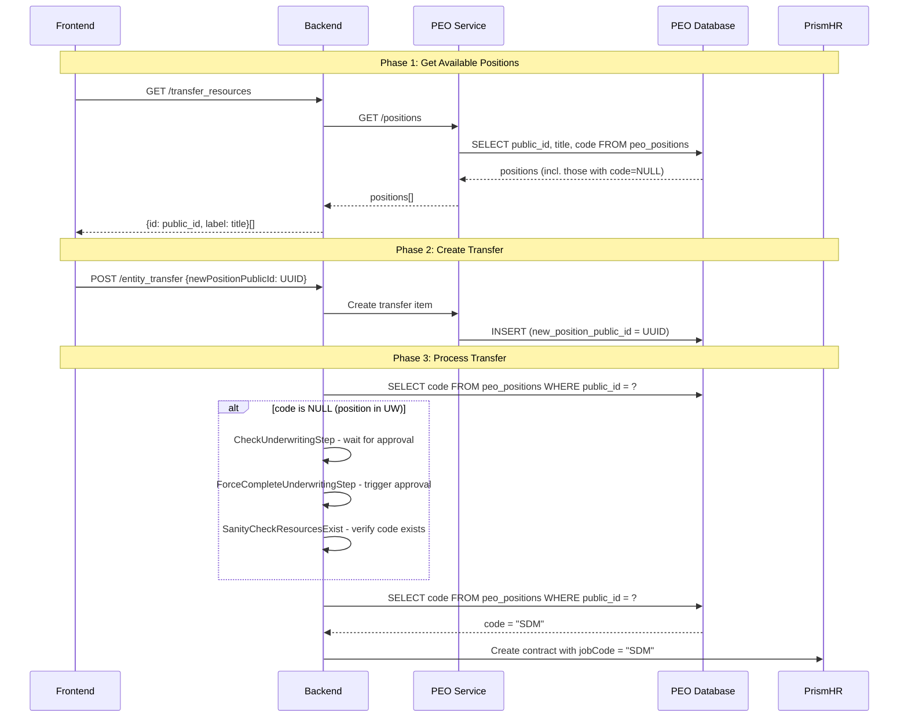

<!--
╔══════════════════════════════════════════════════════════════════╗
║ LAYER: TASK                                                      ║
║ LOCATION: .ai/tasks/in_progress/PEOCM-823/                      ║
╠══════════════════════════════════════════════════════════════════╣
║ BEFORE WORKING ON THIS TASK:                                     ║
║ 1. Read .ai/_project/manifest.yaml (know repos & MCPs)          ║
║ 2. Read this entire README first                                 ║
║ 3. Check which work items are in todo/ vs done/                 ║
║ 4. Work on ONE item at a time from todo/                        ║
╚══════════════════════════════════════════════════════════════════╝
-->

# PEOCM-823: Use position public_id instead of code in entity transfers to support underwriting positions

## Problem Statement

Currently, the `getJobCodes()` method in `TransferResourcesService` filters out positions without a Prism `code`, preventing users from selecting positions that are still in underwriting (UW). This is a temporary fix from PEOCM-792-4.

**The UW workflow:**
1. New position created (e.g., "Sales Development Manager")
2. `peo_contract.job_code = "Sales Development Manager"` (title, not code)
3. `prism_resource_requests` row created, workbench task created
4. When approved in Prism, position gets code (e.g., "SDM")
5. `peo_positions` updated with code, `peo_contract.job_code = "SDM"`

**The fix:** Use `public_id` (UUID, always available) instead of `code` (nullable, only after Prism approval) as the position identifier. Resolve `public_id` → `code` at processing time.

## Acceptance Criteria

**Transfer Resources Endpoint:**
- [ ] `GET /transfer_resources` returns `{id: public_id, label: title}` for positions
- [ ] Positions without Prism code (in UW) are included in the response
- [ ] All returned positions have valid `id` (UUID) and `label` (title)

**Entity Transfer API:**
- [ ] Tech ops endpoint accepts `newPositionPublicId` (UUID) instead of `newJobCode`
- [ ] Validation accepts UUID format for position identifier

**Entity Transfer Processing:**
- [ ] CheckUnderwritingStep detects positions needing UW approval via public_id lookup
- [ ] ForceCompleteUnderwritingStep creates UW request using position title from public_id
- [ ] SanityCheckResourcesExist verifies position has Prism code after UW completion
- [ ] CreateContractStep resolves public_id → code before sending to Prism

**Database Migration:**
- [ ] PEO migration adds `new_position_public_id` (UUID) column to `peo_employee_transfer_items`
- [ ] Migration converts existing `new_job_code` values to `new_position_public_id`
- [ ] Migration removes `new_job_code` column after data migration
- [ ] Model and DTO updated to use `newPositionPublicId`

## Work Items

See `status.yaml` for full index.

| ID | Name | Repo | Status |
|----|------|------|--------|
| 01 | Update transfer_resources to return public_id | backend | todo |
| 02 | Add new_position_public_id column | peo | todo |
| 03 | Migrate existing new_job_code data | peo | todo |
| 04 | Drop new_job_code and finalize schema | peo | todo |
| 05 | Update backend types and validation | backend | todo |
| 06 | Update CheckUnderwritingStep for public_id | backend | todo |
| 07 | Update ForceCompleteUnderwritingStep for public_id | backend | todo |
| 08 | Update SanityCheckResourcesExist for public_id | backend | todo |
| 09 | Update CreateContractStep to resolve public_id | backend | todo |
| 10 | Update EntityTransferClientService for public_id | backend | todo |

## Branches

| Repo | Branch |
|------|--------|
| backend | `PEOCM-823-position-public-id` |
| peo | `PEOCM-823-position-public-id` |

## Technical Context

### Key Database Schema

**peo.peo_positions:**
- `public_id` (UUID): Always present, immutable, unique index
- `code` (VARCHAR 255): Nullable - only set after Prism approval
- `title` (VARCHAR 255): Position title

**peo.peo_employee_transfer_items (current):**
- `new_job_code` (VARCHAR 64): Stores Prism position code

**peo.peo_employee_transfer_items (after migration):**
- `new_position_public_id` (UUID): Stores position public_id

### Key Files

**Backend:**
- `services/peo/entity_transfer/services/transfer_resources_service.ts:210-223` - getJobCodes()
- `services/peo/entity_transfer/types.ts:46` - newJobCode type
- `controllers/admin/peo/tech_ops.ts:329` - Joi validation
- `services/peo/entity_transfer/steps/check_underwriting_request_status_step.ts`
- `services/peo/entity_transfer/steps/force_complete_underwriting_step.ts`
- `services/peo/entity_transfer/steps/sanity_check_resources_exist_step.ts:160-186`
- `services/peo/entity_transfer/steps/create_contract_step.ts:238-240`

**PEO:**
- `src/models/peoPosition/peoPosition.ts` - Position model with public_id
- `src/models/entityTransfer/PeoEmployeeTransferItem.ts:98-103` - new_job_code field
- `src/controllers/entityTransfer/entityTransferDto.ts:10` - Zod validation
- `src/services/entityTransfer/entityTransferService.ts` - Transfer CRUD

## Architecture Diagram

### Position Identifier Flow (After Change)

## Implementation Approach

### Phase 1: PEO Database Migration (Work Items 02-04)
1. Add `new_position_public_id` column (nullable)
2. Migrate existing data: lookup `code` → `public_id` in `peo_positions`
3. Make column NOT NULL, drop `new_job_code`

### Phase 2: Backend Code Changes (Work Items 01, 05-10)
1. Update transfer_resources endpoint to return public_id
2. Update types and validation
3. Update all entity transfer steps to use public_id
4. Add public_id → code resolution in processing steps

## Risks & Considerations

- **Data Migration**: Existing transfers must have valid position codes that can be mapped to public_ids
- **Position Title**: Ensure title is always set (NOT NULL in practice) for display
- **Performance**: Extra DB lookup (public_id → code) in steps - consider caching in TransferContext
- **UW Timing**: If position is in UW, transfer must wait for approval before proceeding

## Testing Strategy

1. **Unit Tests**: Update existing tests for new field names
2. **Integration Tests**: Test full transfer flow with positions in UW
3. **Migration Test**: Verify data migration on staging before production
4. **Manual Test**: Create transfer with position in UW, verify it waits and completes after approval

## Deployment Order

1. **PEO First**: Deploy migrations (02, 03, 04) - adds column, migrates data, drops old column
2. **Backend Second**: Deploy code changes (01, 05-10) - uses new public_id field

## References

- [PEOCM-792-4 - Filter positions without code](../done/PEOCM-792-4/README.md) - Temporary fix this replaces
- [Entity Transfers Documentation](../../docs/backend/entity_transfers/README.md)
- [PEOCM-660 - Entity Transfer Tables](../done/PEOCM-660/README.md) - Original implementation
- JIRA: https://letsdeel.atlassian.net/browse/PEOCM-823
