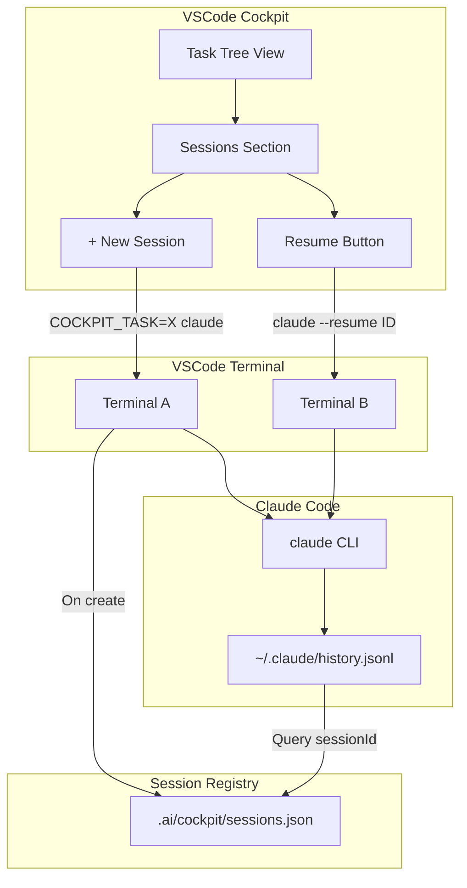

<!--
╔══════════════════════════════════════════════════════════════════╗
║ LAYER: TASK                                                      ║
║ LOCATION: .ai/tasks/in_progress/LOCAL-006/                              ║
╠══════════════════════════════════════════════════════════════════╣
║ BEFORE WORKING ON THIS TASK:                                     ║
║ 1. Read .ai/_project/manifest.yaml (know repos & MCPs)           ║
║ 2. Read this entire README first                                 ║
║ 3. Check which work items are in todo/ vs done/                  ║
║ 4. Work on ONE item at a time from todo/                         ║
╚══════════════════════════════════════════════════════════════════╝
-->

# LOCAL-006: Session Tracking & Resume from Cockpit

## Problem Statement

Users want to work on tasks with multiple Claude sessions in parallel, close terminals, and resume sessions later from the Cockpit UI. Currently:
- Opening a terminal creates a new Claude session
- Closing the terminal loses the session context
- No way to see or resume previous sessions from Cockpit

## Goal

Enable session persistence and resume:
1. Track Claude sessions per task
2. Show sessions in the Cockpit UI
3. Resume closed sessions with full context
4. Support multiple parallel sessions per task

## Acceptance Criteria

- [ ] Sessions are registered when a new Claude terminal is opened
- [ ] Session registry persists in `.ai/cockpit/sessions.json`
- [ ] Cockpit UI shows "Sessions" section under each task
- [ ] Clicking a closed session resumes it with `claude --resume SESSION_ID`
- [ ] Multiple sessions can run in parallel on the same task
- [ ] Session metadata includes: id, taskId, label, createdAt, lastActive

## Work Items

See `status.yaml` for full index.

| ID | Name | Repo | Status |
|----|------|------|--------|
| 01 | Session registry data structure | ai-framework | todo |
| 02 | Capture sessionId on terminal open | vscode-extension | todo |
| 03 | Sessions section in TaskTreeProvider | vscode-extension | todo |
| 04 | Resume session command | vscode-extension | todo |
| 05 | New session command with label | vscode-extension | todo |

## Technical Context

### Claude CLI Session Support

```bash
claude --resume SESSION_ID     # Resume specific session
claude --continue              # Resume most recent
claude --session-id UUID       # Use specific session ID
```

### Session Storage

Claude stores sessions in:
- `~/.claude/history.jsonl` - All conversations with sessionId
- `~/.claude/session-env/{UUID}/` - Session state snapshots

### Cockpit Integration

New file: `.ai/cockpit/sessions.json`
```json
{
  "sessions": [
    {
      "id": "e0920ff0-b9e5-4ff6-9584-0a19919108bc",
      "taskId": "LOCAL-001",
      "label": "Main work",
      "createdAt": "2025-12-29T14:00:00Z",
      "lastActive": "2025-12-29T18:42:00Z",
      "status": "closed"
    }
  ]
}
```

## Architecture Diagram



## Implementation Approach

1. **Session Registry**: Create JSON file to track session-task mappings
2. **Capture**: When opening terminal, capture the sessionId from Claude
3. **Display**: Add "Sessions" collapsible section under each task
4. **Resume**: Use `claude --resume SESSION_ID` to restore context
5. **Lifecycle**: Track active vs closed sessions

## Risks & Considerations

| Risk | Mitigation |
|------|------------|
| Can't capture sessionId until Claude starts | Query ~/.claude/history.jsonl after short delay |
| Session might not be in history yet | Retry with exponential backoff |
| Multiple sessions same task could conflict | Each session has unique ID, env var routes edits |

## Testing Strategy

1. Open terminal for task → verify session registered
2. Make edits → verify events have correct sessionId
3. Close terminal → verify session shows as "closed"
4. Click resume → verify Claude restores full context
5. Open 2 sessions for same task → verify parallel work

## References

- LOCAL-005: Session-to-Task Binding (COCKPIT_TASK env var)
- Claude CLI: `claude --help | grep -i session`
- History file: `~/.claude/history.jsonl`
