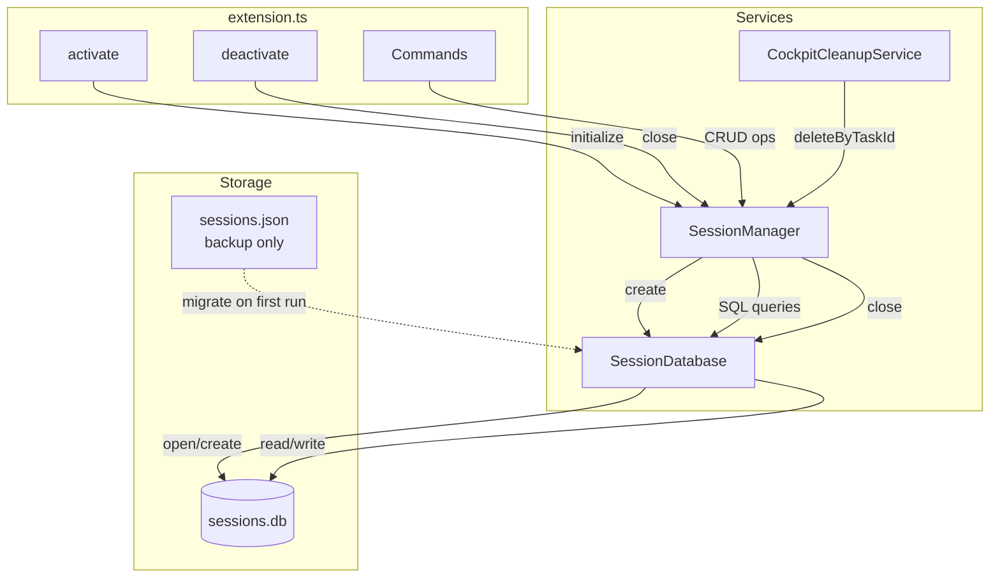
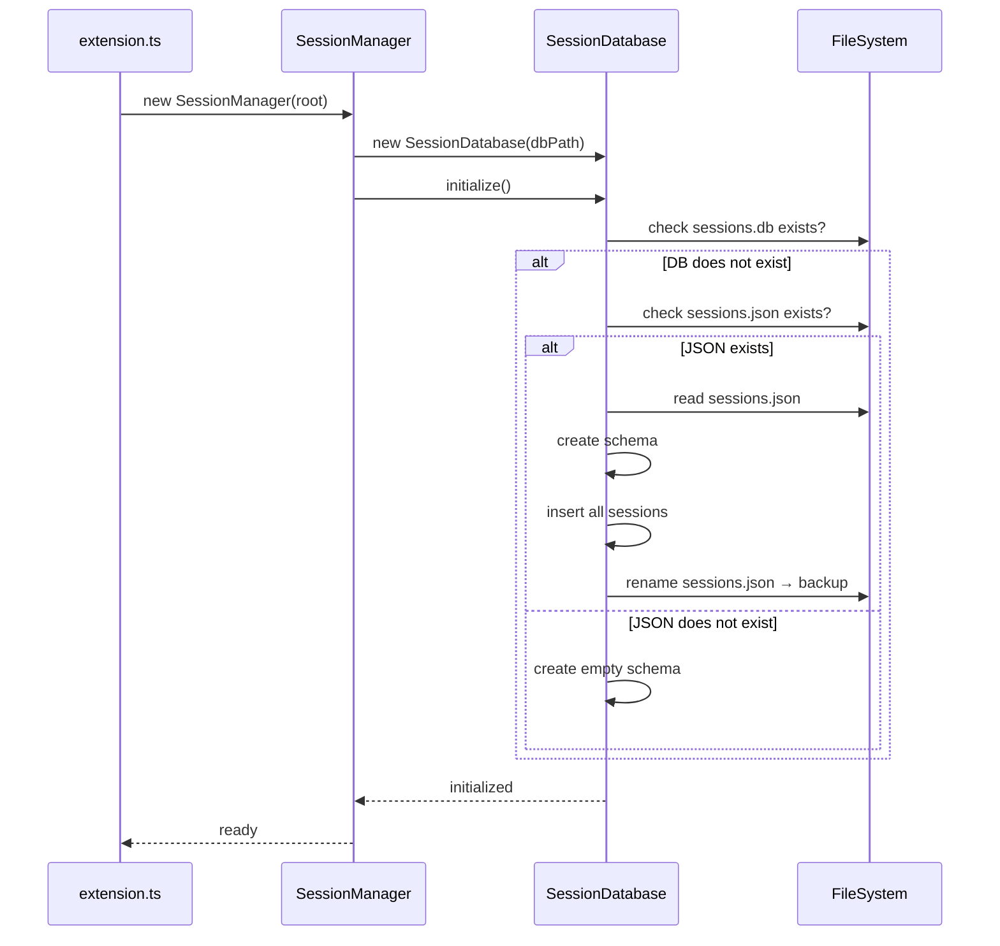

<!--
╔══════════════════════════════════════════════════════════════════╗
║ LAYER: TASK                                                      ║
║ LOCATION: .ai/tasks/todo/LOCAL-023/                              ║
╠══════════════════════════════════════════════════════════════════╣
║ BEFORE WORKING ON THIS TASK:                                     ║
║ 1. Read .ai/_project/manifest.yaml (know repos & MCPs)           ║
║ 2. Read this entire README first                                 ║
║ 3. Check which work items are in todo/ vs done/                  ║
║ 4. Work on ONE item at a time from todo/                         ║
╚══════════════════════════════════════════════════════════════════╝
-->

# LOCAL-023: Migrate SessionManager to SQLite

## Problem Statement

The current session management system uses JSON file persistence (`sessions.json`) with a Promise-chain semaphore for write locking. This approach has caused multiple consistency bugs:

1. **Race conditions** during concurrent terminal creation
2. **No atomic transactions** for multi-file cleanup operations
3. **Direct file access bypass** in CockpitCleanupService (bypasses SessionManager locking)
4. **Lost state** on extension reload (terminal map not persisted)

After three failed attempts to fix these issues with JSON patches, a clean SQLite implementation is needed.

## Acceptance Criteria

- [ ] Sessions stored in SQLite database (`sessions.db`)
- [ ] Existing `sessions.json` migrated automatically on first run
- [ ] All session operations work unchanged (register, update, delete, query)
- [ ] CockpitCleanupService uses SessionManager API (no direct file access)
- [ ] Race conditions eliminated through proper database transactions
- [ ] Tests pass with new database implementation
- [ ] Extension size increase < 2MB (using sql.js WebAssembly)

## Work Items

See `status.yaml` for full index.

| ID | Name | Repo | Status |
|----|------|------|--------|
| 01 | Create SessionDatabase abstraction layer | vscode-extension | todo |
| 02 | Refactor SessionManager to use database | vscode-extension | todo |
| 03 | Refactor CockpitCleanupService to use SessionManager API | vscode-extension | todo |
| 04 | Update extension lifecycle | vscode-extension | todo |
| 05 | Update tests for database | vscode-extension | todo |

## Branches

| Repo | Branch |
|------|--------|
| vscode-extension | `feature/sqlite-sessions` |

## Technical Context

**Key Files:**
- `vscode-extension/src/services/SessionManager.ts` (416 lines) - Current JSON-based implementation
- `vscode-extension/src/services/CockpitCleanupService.ts` (lines 82-113) - Direct JSON access (BUG)
- `vscode-extension/src/extension.ts` (lines 84, 1264-1270) - Lifecycle management
- `vscode-extension/src/types/index.ts` - CockpitSession interface

**Current Data:**
- 8 sessions across 4 tasks in `sessions.json`
- Schema: id, taskId, label, createdAt, lastActive, status, terminalName, terminalId

**Recommended Library:** `sql.js` (WebAssembly SQLite)
- Pure JavaScript, no native binaries
- ~1MB size overhead
- Works cross-platform without compilation

## Architecture Diagrams

### Data Flow



### Migration Sequence



## Implementation Approach

### Phase 1: Database Layer (Work Item 01)
Create `SessionDatabase.ts` with:
- Schema creation with proper indexes
- All CRUD operations (getAllSessions, insert, update, delete)
- Migration utility for JSON → SQLite
- Connection lifecycle (initialize, close)

### Phase 2: SessionManager Refactor (Work Item 02)
- Replace `loadRegistryAsync()` / `saveRegistryAsync()` with database calls
- Keep `withLock()` pattern for write serialization
- Keep public API 100% unchanged
- Add `initialize()` and `close()` methods

### Phase 3: Fix CockpitCleanupService (Work Item 03)
- Add `sessionManager` constructor parameter
- Replace direct JSON file access (lines 82-113) with `sessionManager.deleteByTaskId()`
- This fixes the race condition bug

### Phase 4: Extension Lifecycle (Work Item 04)
- Call `sessionManager.initialize()` on activation (after construction)
- Call `sessionManager.close()` on deactivation
- Handle migration errors gracefully

### Phase 5: Tests (Work Item 05)
- Update `cockpitCleanupService.test.ts` to use SessionManager
- Consider adding `SessionDatabase.test.ts` for unit tests

## SQLite Schema

```sql
CREATE TABLE sessions (
  id TEXT PRIMARY KEY,
  taskId TEXT NOT NULL,
  label TEXT NOT NULL,
  createdAt TEXT NOT NULL,
  lastActive TEXT NOT NULL,
  status TEXT NOT NULL CHECK(status IN ('active', 'closed')),
  terminalName TEXT NOT NULL,
  terminalId TEXT
);

CREATE INDEX idx_sessions_taskId ON sessions(taskId);
CREATE INDEX idx_sessions_status ON sessions(status);
CREATE INDEX idx_sessions_terminalId ON sessions(terminalId);
CREATE INDEX idx_sessions_lastActive ON sessions(lastActive);
```

## Risks & Considerations

- **sql.js initialization**: WebAssembly loading is async, must handle in initialize()
- **Bundle size**: sql.js adds ~1MB, acceptable for reliability gains
- **Migration failures**: Keep JSON backup, log errors, don't delete until verified
- **Concurrency**: Keep withLock() pattern even though SQLite handles locking

## Testing Strategy

1. **Unit tests**: SessionDatabase CRUD operations
2. **Integration tests**: Full session lifecycle (create → update → close → delete)
3. **Migration test**: Verify 8 existing sessions migrate correctly
4. **Race condition test**: Concurrent terminal creation should not duplicate
5. **Manual testing**: Full extension workflow with Cockpit UI

## Feedback

Review comments can be added to `feedback/diff-review.md`.
Use `/address-feedback` to discuss feedback with the agent.

## References

- Exploration analysis: Comprehensive state management audit
- sql.js documentation: https://sql.js.org/
- better-sqlite3 (alternative): https://github.com/WiseLibs/better-sqlite3
