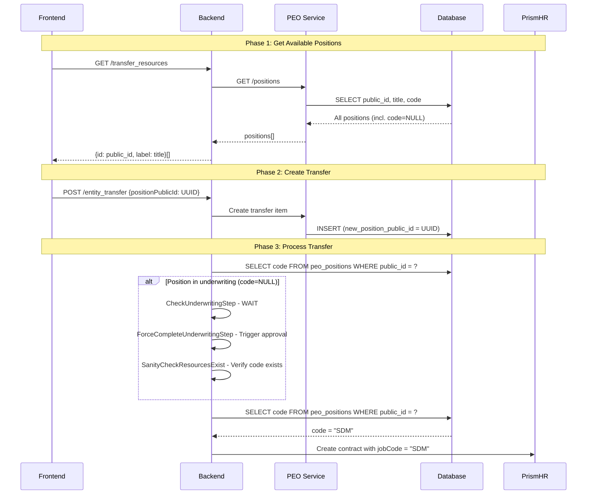

# Entity Transfer Data Structure (Updated)

This document describes the complete entity transfer data structure after PEOCM-660 and PEOCM-823 implementations.

## Changes from Previous Version

### PEOCM-660: Entity Transfer Tables Implementation
- Added full database persistence (3 tables in PEO database)
- Added signature tracking system
- Added agreement management
- Fixed multiple type mismatches in transfer items

### PEOCM-823: Position Public ID Migration
- **Changed**: `jobCode` (VARCHAR) → `positionPublicId` (UUID)
- **Reason**: Support positions in underwriting (without Prism code yet)
- **Impact**: Frontend sends position UUID, backend resolves to code at processing time

## Complete Data Structure

```json
{
  "transfer": {
    "id": "550e8400-e29b-41d4-a716-446655440000",
    "status": "DRAFT",
    "organizationId": 106252,
    "requesterPublicProfileId": "bfad0491-eca1-4857-ac9a-7e30002a44d4",
    "sourceLegalEntity": {
      "publicId": "13c44a93-cf52-4dd3-a1ba-cf8e8404cd10",
      "legalName": "Deel PEO - California",
      "countryId": 233
    },
    "destinationLegalEntity": {
      "publicId": "6569739c-33d5-4897-82f5-5284d2b17e71",
      "legalName": "Deel PEO - Texas",
      "countryId": 233
    },
    "effectiveDate": "2025-02-01",
    "items": [
      {
        "id": "7c9e6679-7425-40de-944b-e07fc1f90ae7",
        "peoContractOid": "EMP12345",
        "employeeName": "John Doe",
        "employeeEmail": "john.doe@company.com",
        "status": "PENDING",
        "benefitGroupId": "400",
        "payGroupId": "cmj1mkiml01to01cngrnz3z1h",
        "ptoPolicyId": "7422d56a-a372-46c5-adbd-9463d16d58cb",
        "workLocationId": "1eb08af5-4ce9-4fb1-8ddd-ab8ae5bb23c6",
        "positionPublicId": "f6355dbb-861d-45e2-9c55-b206ad4c7647",
        "teamId": 205923,
        "newContractOid": null,
        "resumeFromStep": null
      }
    ],
    "signatures": {
      "admins": [
        {
          "publicProfileId": "99b7c17f-3420-4a50-b7d2-58c8c8940f6b",
          "name": "Sarah Chen",
          "email": "sarah.chen@company.com",
          "role": "ADMIN",
          "agreementType": "ENTITY_ASSIGNMENT_AGREEMENT",
          "status": "AWAITING_SIGNATURE",
          "signedAt": null
        }
      ],
      "employees": [
        {
          "publicProfileId": "a1b2c3d4-e5f6-7890-abcd-ef1234567890",
          "name": "John Doe",
          "email": "john.doe@company.com",
          "jobTitle": "Software Developer",
          "role": "EMPLOYEE",
          "agreementType": "ENTITY_ASSIGNMENT_AGREEMENT",
          "status": "AWAITING_SIGNATURE",
          "signedAt": null
        }
      ]
    },
    "agreementId": "d4e5f6a7-b8c9-0123-4567-890abcdef123",
    "createdAt": "2025-01-15T10:30:00Z",
    "updatedAt": "2025-01-15T10:30:00Z"
  },
  "agreement": {
    "id": "d4e5f6a7-b8c9-0123-4567-890abcdef123",
    "pdfUrl": "https://s3.amazonaws.com/deel-documents/agreements/permanent-agreement-2025.pdf",
    "type": "PERMANENT",
    "createdAt": "2025-01-15T10:30:00Z",
    "expiresAt": null
  }
}
```

## Field Types Reference

### Transfer Object

| Field | Type | Example | Notes |
|-------|------|---------|-------|
| `id` | UUID | `"550e8400-e29b-41d4-a716-446655440000"` | Primary key |
| `status` | ENUM | `"DRAFT"` | See status enum below |
| `organizationId` | INTEGER | `106252` | FK to `organizations.id` |
| `requesterPublicProfileId` | UUID | `"bfad0491-eca1-4857-ac9a-7e30002a44d4"` | FK to `profiles.public_id` |
| `sourceLegalEntity.publicId` | UUID | `"13c44a93-cf52-4dd3-a1ba-cf8e8404cd10"` | FK to `legal_entities.public_id` |
| `destinationLegalEntity.publicId` | UUID | `"6569739c-33d5-4897-82f5-5284d2b17e71"` | FK to `legal_entities.public_id` |
| `effectiveDate` | DATE | `"2025-02-01"` | YYYY-MM-DD format, no time |
| `agreementId` | UUID (nullable) | `"d4e5f6a7-b8c9-0123-4567-890abcdef123"` | FK to agreement document |

### Transfer Item Object

| Field | Type | Example | Notes |
|-------|------|---------|-------|
| `id` | UUID | `"7c9e6679-7425-40de-944b-e07fc1f90ae7"` | Primary key |
| `peoContractOid` | VARCHAR(20) | `"EMP12345"` | FK to `peo_contracts.deel_contract_oid` |
| `status` | ENUM | `"PENDING"` | See item status enum below |
| `benefitGroupId` | VARCHAR(10) | `"400"` | FK to `peo_benefit_groups.prism_group_id` |
| `payGroupId` | TEXT | `"cmj1mkiml01to01cngrnz3z1h"` | FK to `employment.payroll_settings.id` (nanoid/CUID) |
| `ptoPolicyId` | UUID | `"7422d56a-a372-46c5-adbd-9463d16d58cb"` | FK to `prism_hr_pto_policies.id` |
| `workLocationId` | UUID | `"1eb08af5-4ce9-4fb1-8ddd-ab8ae5bb23c6"` | FK to `work_locations.public_id` |
| `positionPublicId` | UUID | `"f6355dbb-861d-45e2-9c55-b206ad4c7647"` | FK to `peo_positions.public_id` ⚠️ **PEOCM-823** |
| `teamId` | INTEGER (nullable) | `205923` | FK to `teams.id` |
| `newContractOid` | VARCHAR(20) (nullable) | `"EMP67890"` | Populated after contract creation |
| `resumeFromStep` | VARCHAR(100) (nullable) | `"CheckUnderwritingStep"` | Resume point for failed transfers |

### Signature Object

| Field | Type | Example | Notes |
|-------|------|---------|-------|
| `publicProfileId` | UUID | `"99b7c17f-3420-4a50-b7d2-58c8c8940f6b"` | FK to `profiles.public_id` |
| `role` | ENUM | `"ADMIN"` or `"EMPLOYEE"` | Signer role |
| `agreementType` | ENUM | `"ENTITY_ASSIGNMENT_AGREEMENT"` | Type of agreement |
| `status` | STRING | `"AWAITING_SIGNATURE"` or `"SIGNED"` | Signature status |
| `signedAt` | TIMESTAMP (nullable) | `"2025-01-15T14:30:00Z"` | ISO 8601 format |

### Agreement Object

| Field | Type | Example | Notes |
|-------|------|---------|-------|
| `id` | UUID | `"d4e5f6a7-b8c9-0123-4567-890abcdef123"` | Primary key |
| `pdfUrl` | TEXT | `"https://s3.../agreement.pdf"` | Document URL |
| `type` | STRING | `"PERMANENT"` | Agreement type |
| `expiresAt` | TIMESTAMP (nullable) | `null` | Expiration timestamp |

## Status Enums

### Transfer Status
- `DRAFT` - Initial state, transfer not yet submitted
- `PENDING_SIGNATURES` - Waiting for required signatures
- `SCHEDULED` - Approved and scheduled for processing
- `PROCESSING` - Currently being executed
- `COMPLETED` - Successfully finished
- `PARTIAL_FAILURE` - Some items failed, others succeeded
- `FAILED` - Transfer failed completely
- `CANCELLED` - Transfer was cancelled

### Transfer Item Status
- `PENDING` - Initial state, waiting to be processed
- `PROCESSING` - Currently being executed
- `WAITING_FOR_RESOURCES` - Paused, waiting for external resources (e.g., underwriting approval)
- `COMPLETED` - Successfully finished
- `FAILED` - Item failed during processing

### Signature Role
- `ADMIN` - Admin/requester signature
- `EMPLOYEE` - Employee signature

### Agreement Types
- `ENTITY_ASSIGNMENT_AGREEMENT` - Entity assignment agreement
- `ARBITRATION_AGREEMENT` - Arbitration agreement document
- `WSE_NOTICE_OF_PEO_RELATIONSHIP` - WSE notice document

## Key Changes Summary

### ⚠️ BREAKING CHANGE: Position Identifier (PEOCM-823)

**Before:**
```json
{
  "jobCode": "MGR001"
}
```

**After:**
```json
{
  "positionPublicId": "f6355dbb-861d-45e2-9c55-b206ad4c7647"
}
```

**Why:** Positions in underwriting don't have a Prism `code` yet, only a `public_id`. The backend resolves `public_id` → `code` at processing time.

### Fixed Type Mismatches (PEOCM-660)

| Field | Old Type | New Type | Reason |
|-------|----------|----------|--------|
| `requesterPublicProfileId` | INTEGER | UUID | Semantic fix - field name implies UUID |
| `payGroupId` | UUID | TEXT | Supports nanoid/CUID formats (e.g., `"cmj1mkiml01to01cngrnz3z1h"`) |
| `ptoPolicyId` | VARCHAR(64) | UUID | Type safety - matches `time_off.policies.uid` |
| `workLocationId` | VARCHAR(100) | UUID | Type safety - matches `work_locations.public_id` |
| `newContractOid` | VARCHAR(100) | VARCHAR(20) | Consistency with `peoContractOid` |

## Processing Flow with Position Public ID



## Database Tables

The data is persisted across 3 tables in the PEO database:

1. **`peo_employee_transfers`** - Master transfer records
2. **`peo_employee_transfer_items`** - Individual employee transfers
3. **`peo_employee_transfer_signatures`** - Signature tracking

See `.ai/tasks/done/PEOCM-660/entity-transfer-tables-schema.md` for complete schema details.

## API Endpoints

### PEO Service Endpoints

| Method | Path | Description |
|--------|------|-------------|
| POST | `/peo/entity-transfer/transfers` | Create new transfer |
| GET | `/peo/entity-transfer/transfers/:id` | Get transfer by ID |
| GET | `/peo/entity-transfer/items/:id` | Get transfer item |
| GET | `/peo/entity-transfer/transfers/ready` | Get ready transfers |
| PATCH | `/peo/entity-transfer/transfers/:id/status` | Update transfer status |
| PATCH | `/peo/entity-transfer/items/:id` | Update transfer item |

### Backend Tech Ops Endpoints

| Method | Path | Description |
|--------|------|-------------|
| POST | `/admin/peo/tech_ops/entity_transfer/test_transfer` | Create/resume transfer |
| GET | `/admin/peo/tech_ops/entity_transfer/:id` | Get transfer by ID |
| GET | `/admin/peo/tech_ops/entity_transfer/items/:id` | Get transfer item |
| GET | `/admin/peo/tech_ops/entity_transfer/ready` | Get ready transfers |

## References

- [PEOCM-660 README](.ai/tasks/done/PEOCM-660/README.md) - Entity Transfer Tables Implementation
- [PEOCM-823 README](.ai/tasks/in_progress/PEOCM-823/README.md) - Position Public ID Migration
- [Entity Transfers Documentation](.ai/docs/backend/entity_transfers/README.md)
- [Entity Transfer Tables Schema](.ai/tasks/done/PEOCM-660/entity-transfer-tables-schema.md)
